# Learning Path: From Zero to Rebuilding This Project

Tài liệu này bám theo source code hiện tại của repo `vn-news-summarizer`, không viết theo kiểu lộ trình chung chung. Mục tiêu là giúp bạn đi từ nền tảng đến mức có thể đọc hiểu, sửa lỗi, mở rộng và tự code lại một MVP gần giống dự án.

Repo hiện tại là Python monorepo dùng `uv workspace`, chia thành các package thật:

- `packages/common`: settings, schema, ORM model, utility text/time/url.
- `packages/crawler`: config loader, RSS discover, HTTP client, robots, extraction, dedupe, pipeline, scheduler.
- `packages/labeling`: prompt YAML, Vertex AI wrapper, QC, labeling pipeline, dataset export.
- `packages/training`: dataset loader, extractive baselines, ROUGE/BERTScore eval, ViT5 + LoRA fine-tuning, MLflow helper.
- `packages/inference`: ViT5/LoRA inference loader.
- `packages/api`: FastAPI placeholder với `/` và `/healthz`.
- `apps/web`: Next.js placeholder, chưa có implementation frontend.
- `.github/workflows/ci.yml`: CI thật cho lint, format check, mypy, pytest, YAML sanity.
- `docker-compose.yml`: service `db` và `redis` thật; `api`, `crawler`, `web` còn commented và chưa thấy Dockerfile tương ứng.

Những phần docs có nhắc nhưng chưa thấy implementation hoàn chỉnh trong source:

- Queue/enqueue inference bằng Redis hoặc DB table: docs có nhắc, chưa thấy queue worker/source code.
- FastAPI routers như `/api/articles`, `/api/admin/*`: docs có nhắc, source hiện chỉ có `/` và `/healthz`.
- Next.js UI: chỉ có `apps/web/README.md` hướng dẫn scaffold.
- Inference service + Vertex fallback hot path: `vn_news_inference` mới có loader ViT5/LoRA, chưa có service/fallback pipeline hoàn chỉnh.
- NLI factuality: prompt config có `nli_model`, docs có nhắc, `qc.py` ghi rõ NLI deferred.
- Dockerfile cho API/crawler/web: `docker-compose.yml` comment sẵn nhưng chưa thấy Dockerfile.
- Persist `ModelRun` từ MLflow vào DB: ORM có bảng `model_runs`, nhưng helper hiện log vào MLflow file backend, chưa ghi bảng này.

## 0. Self-assessment checklist

Đánh dấu mức hiện tại của bạn trước khi học. Nếu câu trả lời là `Chưa` hoặc `Cơ bản`, đi đến phase gợi ý trước khi cố đọc sâu code tương ứng.

| Chủ đề | File trong project liên quan | Bạn đã biết chưa? | Nếu chưa thì học Phase nào |
|---|---|---|---|
| Python module/package/import | `packages/*/pyproject.toml`, `packages/*/src/*/__init__.py` | [ ] Chưa [ ] Cơ bản [ ] Ổn [ ] Thành thục | Phase 1 |
| `if __name__ == "__main__"` và `main()` return code | `scripts/run_crawler.py`, `scripts/run_eval.py`, `scripts/run_training.py`, `scripts/run_labeler.py` | [ ] Chưa [ ] Cơ bản [ ] Ổn [ ] Thành thục | Phase 1 |
| `pathlib.Path` | scripts, config loaders, dataset loaders, Alembic env | [ ] Chưa [ ] Cơ bản [ ] Ổn [ ] Thành thục | Phase 1 |
| Type hints, `list[str]`, `str | None`, `Protocol` | Gần như toàn bộ `packages/*/src` | [ ] Chưa [ ] Cơ bản [ ] Ổn [ ] Thành thục | Phase 1 |
| `dataclass(slots=True)` | `crawler.pipeline`, `training.config`, `training.dataset`, `labeling.pipeline`, `inference.finetune_loader` | [ ] Chưa [ ] Cơ bản [ ] Ổn [ ] Thành thục | Phase 1 |
| `argparse` | `scripts/run_crawler.py`, `run_labeler.py`, `run_eval.py`, `run_training.py` | [ ] Chưa [ ] Cơ bản [ ] Ổn [ ] Thành thục | Phase 2 |
| YAML config | `configs/sources.yaml`, `configs/prompts/summarize_v1.yaml`, `configs/training/*.yaml` | [ ] Chưa [ ] Cơ bản [ ] Ổn [ ] Thành thục | Phase 3 |
| Pydantic schema/config validation | `common.schemas`, `common.settings`, `crawler.config`, `labeling.prompt` | [ ] Chưa [ ] Cơ bản [ ] Ổn [ ] Thành thục | Phase 3, Phase 10 |
| Logging khác `print` | `loguru` trong crawler/labeling; `logging` trong eval/training CLI | [ ] Chưa [ ] Cơ bản [ ] Ổn [ ] Thành thục | Phase 4 |
| RSS/feedparser | `crawler.rss`, `tests/integration/test_crawler_e2e.py` | [ ] Chưa [ ] Cơ bản [ ] Ổn [ ] Thành thục | Phase 5 |
| HTTP client, retry, timeout, rate limit | `crawler.http_client`, `crawler.robots`, `labeling.vertex_client` | [ ] Chưa [ ] Cơ bản [ ] Ổn [ ] Thành thục | Phase 6 |
| `async/await`, `asyncio.run`, `asyncio.gather`, semaphore | `crawler.pipeline`, `crawler.scheduler`, `labeling.pipeline`, `common.db` | [ ] Chưa [ ] Cơ bản [ ] Ổn [ ] Thành thục | Phase 7 |
| Text extraction HTML | `crawler.extract`, `tests/fixtures/sample_article.html` | [ ] Chưa [ ] Cơ bản [ ] Ổn [ ] Thành thục | Phase 8 |
| Unicode normalization, whitespace cleanup | `common.text.normalize_text` | [ ] Chưa [ ] Cơ bản [ ] Ổn [ ] Thành thục | Phase 8 |
| URL canonicalization | `common.url_utils` | [ ] Chưa [ ] Cơ bản [ ] Ổn [ ] Thành thục | Phase 9 |
| SimHash, Hamming distance | `common.text`, `crawler.dedupe` | [ ] Chưa [ ] Cơ bản [ ] Ổn [ ] Thành thục | Phase 9 |
| SQLAlchemy ORM | `common.models`, `common.db`, `alembic/versions/*` | [ ] Chưa [ ] Cơ bản [ ] Ổn [ ] Thành thục | Phase 10 |
| Alembic migration | `alembic/env.py`, `alembic/versions/c0b4207319da_init_schema.py` | [ ] Chưa [ ] Cơ bản [ ] Ổn [ ] Thành thục | Phase 10 |
| SQLite/Postgres DSN | `.env.example`, `common.settings`, `docker-compose.yml` | [ ] Chưa [ ] Cơ bản [ ] Ổn [ ] Thành thục | Phase 10 |
| APScheduler | `crawler.scheduler`, `scripts/run_crawler.py --schedule` | [ ] Chưa [ ] Cơ bản [ ] Ổn [ ] Thành thục | Phase 11 |
| Redis/queue | `.env.example`, `docker-compose.yml`, docs architecture | [ ] Chưa [ ] Cơ bản [ ] Ổn [ ] Thành thục | Phase 11 |
| FastAPI route/response model | `api.app`, `tests/unit/test_api_health.py` | [ ] Chưa [ ] Cơ bản [ ] Ổn [ ] Thành thục | Phase 12 |
| Vertex AI/Gemini wrapper | `labeling.vertex_client`, `scripts/run_labeler.py` | [ ] Chưa [ ] Cơ bản [ ] Ổn [ ] Thành thục | Phase 13 |
| Prompt versioning/JSON schema/QC | `configs/prompts/summarize_v1.yaml`, `labeling.prompt`, `labeling.qc` | [ ] Chưa [ ] Cơ bản [ ] Ổn [ ] Thành thục | Phase 13 |
| Hugging Face Transformers | `training.finetune`, `inference.finetune_loader` | [ ] Chưa [ ] Cơ bản [ ] Ổn [ ] Thành thục | Phase 14 |
| PEFT/LoRA | `training.finetune`, `configs/training/*.yaml`, `inference.finetune_loader` | [ ] Chưa [ ] Cơ bản [ ] Ổn [ ] Thành thục | Phase 14 |
| ROUGE/BERTScore | `training.eval`, `scripts/run_eval.py` | [ ] Chưa [ ] Cơ bản [ ] Ổn [ ] Thành thục | Phase 14 |
| MLflow experiment/run/params/metrics | `training.mlflow_utils`, `scripts/run_eval.py`, training YAML | [ ] Chưa [ ] Cơ bản [ ] Ổn [ ] Thành thục | Phase 15 |
| CI/CD GitHub Actions | `.github/workflows/ci.yml` | [ ] Chưa [ ] Cơ bản [ ] Ổn [ ] Thành thục | Phase 16 |
| Docker Compose | `docker-compose.yml`, `.env.example`, `docs/deployment.md` | [ ] Chưa [ ] Cơ bản [ ] Ổn [ ] Thành thục | Phase 17 |
| pytest fixture/mock/async tests | `tests/conftest.py`, `tests/unit/*`, `tests/integration/*` | [ ] Chưa [ ] Cơ bản [ ] Ổn [ ] Thành thục | Phase 18 |

## 1. Project map

### 1.1 Data flow tổng thể

```mermaid
flowchart LR
    A["configs/sources.yaml"] --> B["load_sources_config"]
    B --> C["RSS Discover: feedparser"]
    C --> D["Filter URL hash + robots.txt"]
    D --> E["HTTP Fetch: httpx + retry + rate limit"]
    E --> F["Extract: trafilatura, readability fallback"]
    F --> G["Normalize text + UTC time"]
    G --> H["Dedupe: canonical URL + SimHash"]
    H --> I["Persist: SQLAlchemy articles + crawl_runs"]
    I --> J["Labeling: Vertex AI Gemini teacher"]
    J --> K["QC: length, sentence, numbers, entities"]
    K --> L["Dataset export: train/val/test JSONL"]
    L --> M["Baselines + ROUGE/BERTScore"]
    L --> N["Fine-tune ViT5 + LoRA"]
    N --> O["Inference loader"]
    O --> P["FastAPI API"]
    P --> Q["Next.js web placeholder"]
```



Trong docs có nhắc `Enqueue -> Summarize` qua Redis/DB queue. Trong source hiện tại, phần enqueue/worker inference chưa được implement. Crawler hiện persist `Article` với `status=cleaned`; labeling worker đọc article từ DB và ghi `Label`.

### 1.2 Component inventory từ source thật

| Component | File liên quan | Thư viện thật | Pattern/style | Kiến thức nền | Độ khó | Nên học ở |
|---|---|---|---|---|---|---|
| Project workspace | `pyproject.toml`, package `pyproject.toml` | `uv`, `hatchling`, `ruff`, `mypy`, `pytest` | Monorepo, workspace package, strict typing | Python package, dependency management | Intermediate | Phase 1 |
| CLI | `scripts/run_*.py` | `argparse`, `Path`, `asyncio`, `logging`, `loguru` | `main(argv) -> int`, lazy import, return code | CLI design | Beginner -> Intermediate | Phase 2 |
| Config loader | `crawler.config`, `labeling.prompt`, `training.config`, `common.settings` | `pyyaml`, `pydantic`, `pydantic-settings`, dataclass | Config-driven, validation, typed config | YAML, schema validation | Intermediate | Phase 3 |
| Logging/observability | `crawler.pipeline`, `labeling.pipeline`, `run_eval.py`, `run_training.py` | `loguru`, stdlib `logging` | Structured message template, source stats | log levels, report | Beginner -> Intermediate | Phase 4 |
| RSS discover | `crawler.rss` | `feedparser` | tolerant parser, skip bad entries, normalize dates | RSS/Atom, metadata | Beginner -> Intermediate | Phase 5 |
| HTTP client | `crawler.http_client` | `httpx`, `tenacity`, `asyncio` | wrapper class, per-host limiter, retries | async HTTP, timeout, retry | Advanced | Phase 6 |
| Robots | `crawler.robots` | `httpx`, `urllib.robotparser` | TTL cache, conservative allow on fetch failure | robots.txt, cache | Intermediate | Phase 6 |
| Async pipeline | `crawler.pipeline`, `labeling.pipeline`, `common.db` | `asyncio`, SQLAlchemy async | async context manager, gather, semaphore | event loop, transaction | Advanced | Phase 7 |
| Extraction | `crawler.extract` | `trafilatura`, `readability-lxml`, `bs4` | primary/fallback extractor, dataclass result | HTML vs content text | Intermediate | Phase 8 |
| Normalization | `common.text`, `common.time_utils` | `unicodedata`, `dateutil` | pure functions, deterministic tests | Unicode, datetime timezone | Beginner -> Intermediate | Phase 8 |
| Dedupe | `common.url_utils`, `common.text`, `crawler.dedupe` | `hashlib`, `simhash`, SQLAlchemy select | L1 URL hash, L2 SimHash | canonical URL, Hamming distance | Intermediate -> Advanced | Phase 9 |
| Database | `common.models`, `common.db`, `alembic/*` | `sqlalchemy[asyncio]`, `aiosqlite`, `asyncpg`, `alembic` | ORM models, relationships, indexes, session_scope | ORM, transaction, migration | Advanced | Phase 10 |
| Scheduler | `crawler.scheduler` | `apscheduler` | `AsyncIOScheduler`, `IntervalTrigger`, coalesce | background jobs | Intermediate | Phase 11 |
| Queue | docs, `.env.example`, `docker-compose.yml` | Redis service exists, `redis` dependency in API | Not implemented yet | Queue/worker concept | Intermediate | Phase 11 |
| FastAPI | `api.app`, tests | `fastapi`, `pydantic`, `uvicorn` | response_model, healthcheck | route, schema | Beginner -> Intermediate | Phase 12 |
| LLM labeling | `labeling.*`, `run_labeler.py` | `vertexai`, `tenacity`, `rapidfuzz` | fake override, retry, prompt version, QC | LLM API, JSON output | Advanced | Phase 13 |
| Dataset export | `labeling.dataset`, `training.dataset` | `json`, SQLAlchemy | deterministic split, JSONL | train/val/test | Intermediate | Phase 14 |
| Baselines/eval | `training.baselines`, `training.eval` | `numpy`, `scikit-learn`, `rouge-score`, `bert-score`, `underthesea` | lazy import, extractive summary, metric object | NLP evaluation | Advanced | Phase 14 |
| Fine-tuning | `training.finetune`, `training.preprocess` | `transformers`, `datasets`, `peft`, `torch`, `sentencepiece` | lazy import, Seq2SeqTrainer, LoRA | seq2seq, tokenizer, GPU | Advanced | Phase 14 |
| Inference loader | `inference.finetune_loader` | `transformers`, `peft`, `torch` | lazy model load, adapter detection, batch chunking | model serving basics | Advanced | Phase 14 |
| MLflow | `training.mlflow_utils`, `run_eval.py`, YAML | `mlflow` | context manager, log params/metrics | experiment tracking | Intermediate | Phase 15 |
| CI/CD | `.github/workflows/ci.yml` | GitHub Actions, uv | lint, format check, mypy, pytest, yaml sanity | automation, exit code | Intermediate | Phase 16 |
| Docker | `docker-compose.yml` | Postgres, Redis | service, healthcheck, volume, ports | container basics | Intermediate | Phase 17 |
| Tests | `tests/*` | `pytest`, `pytest-asyncio`, `httpx.MockTransport`, `TestClient` | fixture, fake external deps, integration e2e | testing strategy | Intermediate -> Advanced | Phase 18 |

### 1.3 Thứ tự học khuyến nghị

1. Python project fundamentals.
2. CLI với `argparse`.
3. YAML + typed config.
4. Logging/report.
5. RSS.
6. HTTP + robots + retry + rate limit.
7. Async Python.
8. Extraction + normalization.
9. Dedupe.
10. Database + schemas + Alembic.
11. Scheduling + queue concept.
12. FastAPI.
13. LLM labeling + QC.
14. Dataset, eval, ViT5/LoRA, inference loader.
15. MLflow.
16. CI/CD.
17. Docker.
18. Testing.
19. Capstone tự build lại.

## 1.4 Cách học workbook này nếu bạn đang bắt đầu từ nền tảng yếu

Mỗi phase bây giờ có hai tầng:

1. `Exercise X.0` là tầng cơ bản, không nhất thiết lấy từ project. Mục tiêu là hiểu syntax, data flow và lỗi phổ biến bằng code ngắn chạy độc lập.
2. `Exercise X.1` là tầng tiến gần project. Mục tiêu là dùng kiến thức vừa học để code một bản nhỏ giống behavior của file thật.
3. `Project File Rebuild Task` là tầng rebuild file/module thật. Chỉ làm bước này khi bạn đã chạy được hai bài trước.

Cách học khuyến nghị:

- Gõ lại code trong `Exercise X.0`, không chỉ đọc.
- Chạy code, sửa input, quan sát output.
- Tự viết lại mà không nhìn đáp án.
- Làm `Exercise X.1`.
- Cuối cùng mới mở file thật trong repo để rebuild và so sánh.

# Rebuild Progress Map

Dùng bảng này như bản đồ tiến độ. Mỗi dòng là một lớp của MVP. Khi học xong phase tương ứng, bạn không chỉ hiểu lý thuyết mà còn có một file/module thật đã tự rebuild trong repo nháp.

| Order | Project phase | Files to rebuild | Prerequisite phases | Status |
|---|---|---|---|---|
| 1 | Project skeleton + package exports | `packages/common/src/vn_news_common/__init__.py`, `packages/*/pyproject.toml`, package structure | Phase 1 | [ ] |
| 2 | Shared schemas/settings/utils | `common.schemas`, `common.settings`, `common.text`, `common.time_utils`, `common.url_utils` | Phase 1, 3, 8, 9, 10 | [ ] |
| 3 | Config loading | `crawler.config`, `configs/sources.yaml` | Phase 3 | [ ] |
| 4 | CLI entrypoints | `scripts/run_crawler.py`, `run_labeler.py`, `run_eval.py`, `run_training.py` | Phase 1, 2, 4, 7 | [ ] |
| 5 | RSS discovery | `crawler.rss` | Phase 5 | [ ] |
| 6 | HTTP/robots | `crawler.http_client`, `crawler.robots` | Phase 6, 7 | [ ] |
| 7 | Extract/normalize/dedupe | `crawler.extract`, `crawler.dedupe`, `common.text`, `common.url_utils` | Phase 8, 9 | [ ] |
| 8 | Database persist | `common.models`, `common.db`, Alembic migration, crawler persist logic | Phase 10 | [ ] |
| 9 | Crawler pipeline | `crawler.pipeline`, `crawler.scheduler` | Phase 4-11 | [ ] |
| 10 | Labeling | `labeling.prompt`, `labeling.vertex_client`, `labeling.qc`, `labeling.pipeline`, `scripts/run_labeler.py` | Phase 13 | [ ] |
| 11 | Dataset/eval/training | `training.dataset`, `training.eval`, `training.finetune`, `training.mlflow_utils`, `run_eval.py`, `run_training.py` | Phase 14, 15 | [ ] |
| 12 | Inference/API | `inference.finetune_loader`, `api.app` | Phase 12, 14 | [ ] |
| 13 | CI/Docker/tests | `.github/workflows/ci.yml`, `docker-compose.yml`, `tests/*` | Phase 16-18 | [ ] |

**Cách dùng:** học phase theo thứ tự, làm exercise chuẩn hóa, rồi làm `Project File Rebuild Task`. Nếu task chưa pass test, đừng nhảy phase vì phase sau nối trực tiếp vào file vừa rebuild.

## 2. Phase 1 - Python project fundamentals

**Project source anchors**

`pyproject.toml`, `packages/*/pyproject.toml`, `packages/*/src/*/__init__.py`, `scripts/run_*.py`

**Bạn cần học gì**

- module/package/import
- `src` layout
- `Path`
- type hints
- `main(argv) -> int`
- `if __name__ == "__main__"`
- `__all__` public API

**Vì sao project thiết kế như vậy**

Repo không gom mọi thứ vào một `main.py`. Nó dùng `uv workspace` và nhiều package để crawler, labeling, training, inference, API có boundary rõ, import được trong tests và phát triển độc lập.

### Exercise 1.0 — Từ cơ bản đến gần project: module, function, Path, main

**Goal**

Hiểu phần cơ bản nhất trước khi nhìn source thật. Bài này không yêu cầu giống project ngay; nó giúp bạn nắm cú pháp, luồng dữ liệu và lỗi hay gặp.

**Context**

Project dùng nhiều package. Trước khi hiểu monorepo, bạn cần hiểu một module nhỏ import/export ra sao.

**Requirements**

- Tạo function `word_count`.
- Tạo `main(argv)` nhận text và optional path.
- Dùng `Path.exists()` để validate path.
- Trả exit code thay vì chỉ print.

**Input**

`python warmup_phase1.py --text "xin chào việt nam" --path README.md`

**Expected output / behavior**

In `words=4`; return `0` nếu file tồn tại, `2` nếu không.

**Constraints**

- Viết code nhỏ, tự chạy được trong một file hoặc một package nháp.
- Không copy source thật của project ở bước này.
- Khi đã hiểu bản nhỏ, mới chuyển sang `Exercise 1.1` và `Project File Rebuild Task`.

**Hints**

- Làm happy path trước.
- Thêm validation/error handling sau.
- In/log dữ liệu trung gian để hiểu flow, rồi thay bằng logger/test khi vào project.

**Common mistakes**

- Vào thẳng file thật khi chưa hiểu khái niệm tối thiểu.
- Viết quá nhiều abstraction ở bài đầu.
- Không chạy thử từng bước nhỏ nên lỗi bị dồn lại.

**Self-check**

- [ ] Bạn chạy được code mẫu độc lập.
- [ ] Bạn sửa input và dự đoán được output.
- [ ] Bạn giải thích được bản nhỏ này sẽ tiến hóa thành file nào trong project.

**Solution**

<details><summary>Đáp án code chi tiết</summary>

```python

from __future__ import annotations

import argparse
from pathlib import Path


def word_count(text: str) -> int:
    """Đếm từ đơn giản. Đây là pure function nên rất dễ test."""
    return len(text.split())


def parse_args(argv: list[str] | None = None) -> argparse.Namespace:
    parser = argparse.ArgumentParser(description="Phase 1 warm-up")
    parser.add_argument("--text", required=True)
    parser.add_argument("--path", type=Path, default=Path("README.md"))
    return parser.parse_args(argv)


def main(argv: list[str] | None = None) -> int:
    args = parse_args(argv)
    if not args.path.exists():
        print(f"missing path: {args.path}")
        return 2

    print(f"words={word_count(args.text)}")
    return 0


if __name__ == "__main__":
    raise SystemExit(main())
```

Hãy tự gõ lại code trước, chạy thử, rồi thay đổi input để xem behavior. Khi code này không còn khó hiểu, chuyển sang bài `1.1`.
</details>

### Exercise 1.1 — Build package Python nhỏ theo style repo

**Goal**

Nắm chắc kiến thức phase này bằng một bài build nhỏ có output rõ, sau đó dùng chính kiến thức đó để rebuild file thật.

**Context**

Chuẩn bị cho skeleton `packages/common`, `packages/crawler` và các script trong `scripts/`.

**Requirements**

- Tạo package nháp `toy_common` có `__init__.py` và `text.py`.
- Implement `word_count(text: str) -> int` như pure function.
- Tạo script `toy_run.py` có `main(argv: list[str] | None = None) -> int`.
- Script dùng `Path` để kiểm tra `--path`.
- Script chỉ chạy qua guard `if __name__ == "__main__"`.

**Input**

`python toy_run.py --path README.md --text "tin tức việt nam"`

**Expected output / behavior**

In số từ, return `0` nếu path tồn tại, return `2` nếu path không tồn tại.

**Constraints**

- Không hard-code absolute path.
- Không để logic chạy ở top-level khi import.
- Public function có type hints.

**Hints**

- Viết pure function trước.
- Tách parser/script khỏi package logic.
- Test bằng `main([...])`.

**Common mistakes**

- Quên `__init__.py`.
- Dùng string path rồi gọi `.exists()`.
- Gọi `sys.exit()` trong logic cần test.

**Self-check**

- [ ] Code chạy được bằng input/command ở trên.
- [ ] Có test hoặc assert cho behavior chính.
- [ ] Không vi phạm constraints.
- [ ] Bạn giải thích được bài này nối vào file thật nào.

**Solution**

<details><summary>Đáp án code chi tiết</summary>

```python

from __future__ import annotations

import argparse
from pathlib import Path


def word_count(text: str) -> int:
    return len(text.split())


def build_message(text: str, path: Path) -> str:
    return f"path={path} words={word_count(text)}"


def parse_args(argv: list[str] | None = None) -> argparse.Namespace:
    parser = argparse.ArgumentParser(description="project-style script")
    parser.add_argument("--text", required=True)
    parser.add_argument("--path", type=Path, default=Path("README.md"))
    return parser.parse_args(argv)


def main(argv: list[str] | None = None) -> int:
    args = parse_args(argv)
    if not args.path.exists():
        print(f"ERROR: path not found: {args.path}")
        return 2
    print(build_message(args.text, args.path))
    return 0


if __name__ == "__main__":
    raise SystemExit(main())
```

</details>

### Project File Rebuild Task

#### Project File Rebuild Task — package skeleton + `scripts/run_crawler.py` skeleton

**You have learned**

- module/package/import
- `src` layout
- `Path`
- type hints
- `main(argv) -> int`
- `if __name__ == "__main__"`
- `__all__` public API

**Original file role**

Package `__init__.py` định nghĩa API public; script crawler là entrypoint điều phối, không chứa toàn bộ business logic.

**Your task**

Hãy tự code lại file/module này trong repo nháp. Không copy source thật ngay. Đọc behavior, đóng file lại, tự implement theo contract dưới đây, sau đó mới đối chiếu với source gốc.

**Functional requirements**

- Mọi package import được sau `uv sync`.
- CLI skeleton chạy được và trả exit code.
- Chưa gọi HTTP/DB thật ở phase này.

**CLI/API/function signature**

`def main(argv: list[str] | None = None) -> int`; package exports qua `__all__`.

**Input examples**

`python toy_run.py --path README.md --text "tin tức việt nam"`

**Expected output examples**

In số từ, return `0` nếu path tồn tại, return `2` nếu path không tồn tại.

**Integration point**

Phase 2 thay skeleton CLI bằng parser thật; Phase 3 nối CLI vào config loader.

**Tests to pass**

- `uv run python -c "import vn_news_common, vn_news_crawler"`
- unit test gọi `main([])` không crash

**Completion badge**

✅ Sau khi hoàn thành task này, bạn đã rebuild được package skeleton + `scripts/run_crawler.py` skeleton.
✅ Unlock: Python project fundamentals.

**Solution sketch**

Skeleton/hướng giải: bắt đầu từ signature, implement happy path, thêm validation/error handling, rồi nối vào test/integration point.

<details><summary>Full solution outline để đối chiếu sau khi tự làm</summary>

- Bắt đầu từ public contract: `def main(argv: list[str] | None = None) -> int`; package exports qua `__all__`.
- Implement behavior tối thiểu trước: Mọi package import được sau `uv sync`.
- Thêm từng edge case còn lại.
- Chạy tests: `uv run python -c "import vn_news_common, vn_news_crawler"`, unit test gọi `main([])` không crash
- Mở original file sau cùng để so sánh naming, error handling, logging và integration.
</details>

### Files you can now rebuild

- `packages/*/src/*/__init__.py`
- root/package `pyproject.toml` skeleton
- `scripts/run_crawler.py` skeleton

### End-of-Phase Build Checkpoint

- Bạn đã học: module/package/import, `src` layout, `Path`, type hints, `main(argv) -> int`, `if __name__ == "__main__"`, `__all__` public API.
- Bạn đã rebuild được: package skeleton + `scripts/run_crawler.py` skeleton.
- File/module này nằm trong flow: Phase 2 thay skeleton CLI bằng parser thật; Phase 3 nối CLI vào config loader.
- Bước tiếp theo sẽ nối vào output của phase này.
- Mini integration test cần chạy: `uv run python -c "import vn_news_common, vn_news_crawler"`.

Bạn đã có khung importable: script điều phối, package giữ logic.

## 3. Phase 2 - CLI tools with argparse

**Project source anchors**

`scripts/run_crawler.py`, `scripts/run_labeler.py`, `scripts/run_eval.py`, `scripts/run_training.py`

**Bạn cần học gì**

- `ArgumentParser`
- `add_argument`
- `type=Path`
- `default`
- `action="append"`
- `action="store_true"`
- `choices`
- exit code

**Vì sao project thiết kế như vậy**

CLI cho phép đổi source, config, dataset, log level, schedule mode mà không sửa source code. Đây là điều kiện để Makefile, CI, Docker và batch jobs chạy ổn định.

### Exercise 2.0 — Từ cơ bản đến gần project: argparse từng option một

**Goal**

Hiểu phần cơ bản nhất trước khi nhìn source thật. Bài này không yêu cầu giống project ngay; nó giúp bạn nắm cú pháp, luồng dữ liệu và lỗi hay gặp.

**Context**

Trước khi rebuild crawler CLI, hãy hiểu từng loại argument: string, int, Path, flag boolean, repeatable flag.

**Requirements**

- Parse `--name` string.
- Parse `--age` int.
- Parse `--config` Path.
- Parse nhiều `--source`.
- Parse `--schedule` boolean.

**Input**

`python warmup_phase2.py --name An --age 21 --source vnexpress --source tuoitre --schedule`

**Expected output / behavior**

In ra dict có name, age, sources, schedule.

**Constraints**

- Viết code nhỏ, tự chạy được trong một file hoặc một package nháp.
- Không copy source thật của project ở bước này.
- Khi đã hiểu bản nhỏ, mới chuyển sang `Exercise 2.1` và `Project File Rebuild Task`.

**Hints**

- Làm happy path trước.
- Thêm validation/error handling sau.
- In/log dữ liệu trung gian để hiểu flow, rồi thay bằng logger/test khi vào project.

**Common mistakes**

- Vào thẳng file thật khi chưa hiểu khái niệm tối thiểu.
- Viết quá nhiều abstraction ở bài đầu.
- Không chạy thử từng bước nhỏ nên lỗi bị dồn lại.

**Self-check**

- [ ] Bạn chạy được code mẫu độc lập.
- [ ] Bạn sửa input và dự đoán được output.
- [ ] Bạn giải thích được bản nhỏ này sẽ tiến hóa thành file nào trong project.

**Solution**

<details><summary>Đáp án code chi tiết</summary>

```python

from __future__ import annotations

import argparse
from pathlib import Path


def build_parser() -> argparse.ArgumentParser:
    parser = argparse.ArgumentParser(description="Argparse warm-up")
    parser.add_argument("--name", default="unknown")
    parser.add_argument("--age", type=int, default=18)
    parser.add_argument("--config", type=Path, default=Path("configs/sources.yaml"))
    parser.add_argument("--source", action="append", default=None)
    parser.add_argument("--schedule", action="store_true")
    parser.add_argument(
        "--log-level",
        choices=["DEBUG", "INFO", "WARNING", "ERROR"],
        default="INFO",
    )
    return parser


def main(argv: list[str] | None = None) -> int:
    args = build_parser().parse_args(argv)
    print(
        {
            "name": args.name,
            "age": args.age,
            "config": str(args.config),
            "sources": args.source or [],
            "schedule": args.schedule,
            "log_level": args.log_level,
        }
    )
    return 0


if __name__ == "__main__":
    raise SystemExit(main())
```

Hãy tự gõ lại code trước, chạy thử, rồi thay đổi input để xem behavior. Khi code này không còn khó hiểu, chuyển sang bài `2.1`.
</details>

### Exercise 2.1 — Crawler CLI từ đơn giản đến gần project

**Goal**

Nắm chắc kiến thức phase này bằng một bài build nhỏ có output rõ, sau đó dùng chính kiến thức đó để rebuild file thật.

**Context**

Chuẩn bị trực tiếp cho `scripts/run_crawler.py`.

**Requirements**

- Level 1: CLI `--name` in greeting.
- Level 2: thêm `--config type=Path` và validate tồn tại.
- Level 3: thêm `--source action="append"`.
- Level 4: thêm `--schedule`, `--interval`, `--log-level choices` và chọn one-shot/scheduler.

**Input**

`python toy_crawler.py --config configs/sources.yaml --source vnexpress --source tuoitre --log-level DEBUG`

**Expected output / behavior**

`config` là `Path`, `source == ['vnexpress','tuoitre']`, mode `once` nếu không có `--schedule`, return `2` nếu config thiếu.

**Constraints**

- `--source` dùng `action="append"`.
- `--schedule` dùng `store_true`.
- `--log-level` có `choices`.

**Hints**

- Tách `_parse_args(argv)` khỏi `main`.
- Dùng `REPO_ROOT / 'configs' / 'sources.yaml'`.
- Exercise chỉ in/log args, chưa crawl thật.

**Common mistakes**

- Dùng comma-separated source, khác behavior project.
- Không phân biệt all sources (`None`) và list cụ thể.
- Config missing nhưng vẫn gọi loader.

**Self-check**

- [ ] Code chạy được bằng input/command ở trên.
- [ ] Có test hoặc assert cho behavior chính.
- [ ] Không vi phạm constraints.
- [ ] Bạn giải thích được bài này nối vào file thật nào.

**Solution**

<details><summary>Đáp án code chi tiết</summary>

```python

from __future__ import annotations

import argparse
import asyncio
from pathlib import Path


DEFAULT_CONFIG = Path("configs/sources.yaml")


def parse_args(argv: list[str] | None = None) -> argparse.Namespace:
    parser = argparse.ArgumentParser(description="toy crawler cli")
    parser.add_argument("--config", type=Path, default=DEFAULT_CONFIG)
    parser.add_argument("--source", action="append", default=None)
    parser.add_argument("--schedule", action="store_true")
    parser.add_argument("--interval", type=int, default=30)
    parser.add_argument("--log-level", choices=["DEBUG", "INFO", "WARNING", "ERROR"], default="INFO")
    return parser.parse_args(argv)


async def run_once(config: Path, sources: list[str] | None) -> int:
    print(f"run once config={config} sources={sources or 'all'}")
    return 0


async def run_schedule(config: Path, sources: list[str] | None, interval: int) -> int:
    print("scheduler start")
    await run_once(config, sources)  # project behavior: run ngay lần đầu
    print(f"next run after {interval} minutes")
    return 0


def main(argv: list[str] | None = None) -> int:
    args = parse_args(argv)
    if not args.config.exists():
        print(f"ERROR config not found: {args.config}")
        return 2
    if args.schedule:
        return asyncio.run(run_schedule(args.config, args.source, args.interval))
    return asyncio.run(run_once(args.config, args.source))


if __name__ == "__main__":
    raise SystemExit(main())
```

</details>

### Project File Rebuild Task

#### Project File Rebuild Task — `scripts/run_crawler.py`

**You have learned**

- `ArgumentParser`
- `add_argument`
- `type=Path`
- `default`
- `action="append"`
- `action="store_true"`
- `choices`
- exit code

**Original file role**

Entry point crawler: parse args, configure logger, chọn one-shot/scheduler, gọi async runner và trả exit code.

**Your task**

Hãy tự code lại file/module này trong repo nháp. Không copy source thật ngay. Đọc behavior, đóng file lại, tự implement theo contract dưới đây, sau đó mới đối chiếu với source gốc.

**Functional requirements**

- Hỗ trợ `--config`, `--source`, `--schedule`, `--interval`, `--log-level`.
- Config thiếu thì log error và return `2`.
- One-shot gọi `run_once`; schedule mode tạo scheduler, run ngay lần đầu rồi wait.
- Return `1` nếu one-shot không insert bài nào theo behavior hiện tại.

**CLI/API/function signature**

`_parse_args(argv) -> argparse.Namespace`; `_run_once(args) -> int`; `_run_schedule(args) -> int`; `main(argv) -> int`.

**Input examples**

`python toy_crawler.py --config configs/sources.yaml --source vnexpress --source tuoitre --log-level DEBUG`

**Expected output examples**

`config` là `Path`, `source == ['vnexpress','tuoitre']`, mode `once` nếu không có `--schedule`, return `2` nếu config thiếu.

**Integration point**

CLI gọi `load_sources_config` và `crawler.pipeline.run_once`.

**Tests to pass**

- unit test `_parse_args(['--source','a','--source','b'])`
- invalid config returns `2`
- schedule mode được mock để không loop vô hạn

**Completion badge**

✅ Sau khi hoàn thành task này, bạn đã rebuild được `scripts/run_crawler.py`.
✅ Unlock: CLI tools with argparse.

**Solution sketch**

Skeleton/hướng giải: bắt đầu từ signature, implement happy path, thêm validation/error handling, rồi nối vào test/integration point.

<details><summary>Full solution outline để đối chiếu sau khi tự làm</summary>

- Bắt đầu từ public contract: `_parse_args(argv) -> argparse.Namespace`; `_run_once(args) -> int`; `_run_schedule(args) -> int`; `main(argv) -> int`.
- Implement behavior tối thiểu trước: Hỗ trợ `--config`, `--source`, `--schedule`, `--interval`, `--log-level`.
- Thêm từng edge case còn lại.
- Chạy tests: unit test `_parse_args(['--source','a','--source','b'])`, invalid config returns `2`, schedule mode được mock để không loop vô hạn
- Mở original file sau cùng để so sánh naming, error handling, logging và integration.
</details>

### Files you can now rebuild

- `scripts/run_crawler.py`
- CLI pattern cho `run_labeler.py`, `run_eval.py`, `run_training.py`

### End-of-Phase Build Checkpoint

- Bạn đã học: `ArgumentParser`, `add_argument`, `type=Path`, `default`, `action="append"`, `action="store_true"`, `choices`, exit code.
- Bạn đã rebuild được: `scripts/run_crawler.py`.
- File/module này nằm trong flow: CLI gọi `load_sources_config` và `crawler.pipeline.run_once`.
- Bước tiếp theo sẽ nối vào output của phase này.
- Mini integration test cần chạy: unit test `_parse_args(['--source','a','--source','b'])`.

Bạn đã unlock lớp CLI orchestration cho toàn repo.

## 4. Phase 3 - Config-driven programming with YAML

**Project source anchors**

`configs/sources.yaml`, `configs/prompts/summarize_v1.yaml`, `configs/training/*.yaml`, `crawler.config`, `labeling.prompt`, `training.config`

**Bạn cần học gì**

- YAML
- `yaml.safe_load`
- Pydantic validation
- dataclass config
- defaults
- category aliases
- config không hard-code

**Vì sao project thiết kế như vậy**

Nguồn báo, prompt, model, LoRA và dataset version thay đổi thường xuyên. YAML đưa dữ liệu vận hành ra khỏi code nhưng vẫn được validate typed.

### Exercise 3.0 — Từ cơ bản đến gần project: đọc YAML rồi validate bằng class nhỏ

**Goal**

Hiểu phần cơ bản nhất trước khi nhìn source thật. Bài này không yêu cầu giống project ngay; nó giúp bạn nắm cú pháp, luồng dữ liệu và lỗi hay gặp.

**Context**

Project dùng YAML để không hard-code source báo, prompt, training config. Bản nhỏ giúp bạn hiểu load -> validate -> dùng.

**Requirements**

- Đọc YAML string.
- Chuyển thành object `MiniSource`.
- Validate RSS phải là list không rỗng.
- Lọc source `enabled=True`.

**Input**

YAML string có 2 source, một source disabled.

**Expected output / behavior**

Chỉ in source enabled; RSS rỗng raise `ValueError`.

**Constraints**

- Viết code nhỏ, tự chạy được trong một file hoặc một package nháp.
- Không copy source thật của project ở bước này.
- Khi đã hiểu bản nhỏ, mới chuyển sang `Exercise 3.1` và `Project File Rebuild Task`.

**Hints**

- Làm happy path trước.
- Thêm validation/error handling sau.
- In/log dữ liệu trung gian để hiểu flow, rồi thay bằng logger/test khi vào project.

**Common mistakes**

- Vào thẳng file thật khi chưa hiểu khái niệm tối thiểu.
- Viết quá nhiều abstraction ở bài đầu.
- Không chạy thử từng bước nhỏ nên lỗi bị dồn lại.

**Self-check**

- [ ] Bạn chạy được code mẫu độc lập.
- [ ] Bạn sửa input và dự đoán được output.
- [ ] Bạn giải thích được bản nhỏ này sẽ tiến hóa thành file nào trong project.

**Solution**

<details><summary>Đáp án code chi tiết</summary>

```python

from __future__ import annotations

from dataclasses import dataclass

import yaml


@dataclass(frozen=True)
class MiniSource:
    id: str
    name: str
    rss: list[str]
    enabled: bool = True

    @classmethod
    def from_dict(cls, raw: dict) -> "MiniSource":
        rss = raw.get("rss")
        if not isinstance(rss, list) or not rss:
            raise ValueError(f"source {raw.get('id')} must have non-empty rss list")
        return cls(
            id=str(raw["id"]),
            name=str(raw["name"]),
            rss=[str(url) for url in rss],
            enabled=bool(raw.get("enabled", True)),
        )


def load_sources(text: str) -> list[MiniSource]:
    data = yaml.safe_load(text)
    sources = [MiniSource.from_dict(item) for item in data["sources"]]
    return [src for src in sources if src.enabled]


raw_yaml = """
sources:
  - id: vnexpress
    name: VnExpress
    enabled: true
    rss:
      - https://vnexpress.net/rss/tin-moi-nhat.rss
  - id: disabled
    name: Disabled Source
    enabled: false
    rss:
      - https://example.com/rss.xml
"""

for source in load_sources(raw_yaml):
    print(source.id, source.rss[0])
```

Hãy tự gõ lại code trước, chạy thử, rồi thay đổi input để xem behavior. Khi code này không còn khó hiểu, chuyển sang bài `3.1`.
</details>

### Exercise 3.1 — Load và validate source config

**Goal**

Nắm chắc kiến thức phase này bằng một bài build nhỏ có output rõ, sau đó dùng chính kiến thức đó để rebuild file thật.

**Context**

Chuẩn bị cho `vn_news_crawler/config.py` và `common.schemas.SourceConfig`.

**Requirements**

- Đọc YAML có `defaults`, `sources`, `canonical_categories`.
- Validate source có `id`, `name`, `domain`, `rss`, `enabled`.
- Implement `enabled()` chỉ trả source bật.
- Implement `find_canonical_category(raw)` dựa trên alias.

**Input**

YAML có `vnexpress` enabled, `laodong` disabled, category raw `Kinh doanh`.

**Expected output / behavior**

`enabled()` chỉ có source bật; `Kinh doanh` map về `kinh_doanh`; RSS URL invalid bị validation error.

**Constraints**

- Dùng `yaml.safe_load`.
- RSS phải validate URL/list.
- Không mutate raw dict sau validate.

**Hints**

- `SourceConfig` đặt ở common.
- Dùng `Field(default_factory=list)`.
- Alias matching nên case-insensitive.

**Common mistakes**

- Hard-code source trong Python.
- `rss` là string thay vì list.
- Quên đọc UTF-8.

**Self-check**

- [ ] Code chạy được bằng input/command ở trên.
- [ ] Có test hoặc assert cho behavior chính.
- [ ] Không vi phạm constraints.
- [ ] Bạn giải thích được bài này nối vào file thật nào.

**Solution**

<details><summary>Đáp án code chi tiết</summary>

```python

from __future__ import annotations

from pathlib import Path
from pydantic import BaseModel, Field, HttpUrl
import yaml


class SourceConfig(BaseModel):
    id: str
    name: str
    domain: str
    rss: list[HttpUrl]
    enabled: bool = True
    max_items_per_feed: int = 20


class SourcesConfig(BaseModel):
    sources: list[SourceConfig] = Field(default_factory=list)
    canonical_categories: dict[str, list[str]] = Field(default_factory=dict)

    def enabled_sources(self) -> list[SourceConfig]:
        return [source for source in self.sources if source.enabled]


def load_sources_config(path: str | Path) -> SourcesConfig:
    raw = yaml.safe_load(Path(path).read_text(encoding="utf-8"))
    return SourcesConfig.model_validate(raw)


def find_canonical_category(raw: str | None, aliases: dict[str, list[str]]) -> str | None:
    if not raw:
        return None
    needle = raw.lower().replace("-", " ")
    for canonical, values in aliases.items():
        if canonical.lower().replace("_", " ") in needle:
            return canonical
        for alias in values:
            if alias.lower().replace("-", " ") in needle:
                return canonical
    return None
```

</details>

### Project File Rebuild Task

#### Project File Rebuild Task — `packages/crawler/src/vn_news_crawler/config.py` + `configs/sources.yaml`

**You have learned**

- YAML
- `yaml.safe_load`
- Pydantic validation
- dataclass config
- defaults
- category aliases
- config không hard-code

**Original file role**

Biến YAML nguồn báo thành object typed để crawler discover/fetch mà không hard-code.

**Your task**

Hãy tự code lại file/module này trong repo nháp. Không copy source thật ngay. Đọc behavior, đóng file lại, tự implement theo contract dưới đây, sau đó mới đối chiếu với source gốc.

**Functional requirements**

- Load real `configs/sources.yaml`.
- Validate RSS/domain/defaults.
- Filter enabled sources.
- Map category publisher về canonical category.

**CLI/API/function signature**

`class SourcesConfig(BaseModel)`; `load_sources_config(path)`; `find_canonical_category(raw, canonical)`.

**Input examples**

YAML có `vnexpress` enabled, `laodong` disabled, category raw `Kinh doanh`.

**Expected output examples**

`enabled()` chỉ có source bật; `Kinh doanh` map về `kinh_doanh`; RSS URL invalid bị validation error.

**Integration point**

`scripts/run_crawler.py` gọi loader; `crawler.pipeline` dùng config cho RSS/fetch.

**Tests to pass**

- `tests/unit/test_config.py`
- CI YAML sanity
- disabled source không xuất hiện trong `enabled()`

**Completion badge**

✅ Sau khi hoàn thành task này, bạn đã rebuild được `packages/crawler/src/vn_news_crawler/config.py` + `configs/sources.yaml`.
✅ Unlock: Config-driven programming with YAML.

**Solution sketch**

Skeleton/hướng giải: bắt đầu từ signature, implement happy path, thêm validation/error handling, rồi nối vào test/integration point.

<details><summary>Full solution outline để đối chiếu sau khi tự làm</summary>

- Bắt đầu từ public contract: `class SourcesConfig(BaseModel)`; `load_sources_config(path)`; `find_canonical_category(raw, canonical)`.
- Implement behavior tối thiểu trước: Load real `configs/sources.yaml`.
- Thêm từng edge case còn lại.
- Chạy tests: `tests/unit/test_config.py`, CI YAML sanity, disabled source không xuất hiện trong `enabled()`
- Mở original file sau cùng để so sánh naming, error handling, logging và integration.
</details>

### Files you can now rebuild

- `configs/sources.yaml`
- `common.schemas.SourceConfig`
- `crawler.config`

### End-of-Phase Build Checkpoint

- Bạn đã học: YAML, `yaml.safe_load`, Pydantic validation, dataclass config, defaults, category aliases, config không hard-code.
- Bạn đã rebuild được: `packages/crawler/src/vn_news_crawler/config.py` + `configs/sources.yaml`.
- File/module này nằm trong flow: `scripts/run_crawler.py` gọi loader; `crawler.pipeline` dùng config cho RSS/fetch.
- Bước tiếp theo sẽ nối vào output của phase này.
- Mini integration test cần chạy: `tests/unit/test_config.py`.

CLI bây giờ có thể nhận `--config` và load nguồn thật.

## 5. Phase 4 - Logging and observability

**Project source anchors**

`crawler.pipeline.SourceStats`, `crawler.pipeline.CrawlReport`, `scripts/run_crawler.py`, `labeling.pipeline.LabelStats`, `scripts/run_labeler.py`

**Bạn cần học gì**

- logger vs print
- DEBUG/INFO/WARNING/ERROR
- loguru
- stats dataclass
- report per source
- structured messages

**Vì sao project thiết kế như vậy**

Crawler nhiều source và lỗi I/O. Logger/report cho biết source nào fail vì robots, fetch, extract, dedupe, thay vì chỉ thấy script im lặng.

### Exercise 4.0 — Từ cơ bản đến gần project: logger và report object

**Goal**

Hiểu phần cơ bản nhất trước khi nhìn source thật. Bài này không yêu cầu giống project ngay; nó giúp bạn nắm cú pháp, luồng dữ liệu và lỗi hay gặp.

**Context**

Trước khi đọc `CrawlReport`, bạn cần thấy vì sao report object tốt hơn print rời rạc.

**Requirements**

- Tạo dataclass `SourceStats`.
- Tăng counter trong vòng lặp giả lập.
- Log theo level INFO/WARNING.
- Không để errors dùng mutable default.

**Input**

Danh sách status `['ok', 'dupe', 'fetch_error', 'ok']`.

**Expected output / behavior**

Log `inserted=2`, `skipped_dupe=1`, `fetch_failed=1`.

**Constraints**

- Viết code nhỏ, tự chạy được trong một file hoặc một package nháp.
- Không copy source thật của project ở bước này.
- Khi đã hiểu bản nhỏ, mới chuyển sang `Exercise 4.1` và `Project File Rebuild Task`.

**Hints**

- Làm happy path trước.
- Thêm validation/error handling sau.
- In/log dữ liệu trung gian để hiểu flow, rồi thay bằng logger/test khi vào project.

**Common mistakes**

- Vào thẳng file thật khi chưa hiểu khái niệm tối thiểu.
- Viết quá nhiều abstraction ở bài đầu.
- Không chạy thử từng bước nhỏ nên lỗi bị dồn lại.

**Self-check**

- [ ] Bạn chạy được code mẫu độc lập.
- [ ] Bạn sửa input và dự đoán được output.
- [ ] Bạn giải thích được bản nhỏ này sẽ tiến hóa thành file nào trong project.

**Solution**

<details><summary>Đáp án code chi tiết</summary>

```python

from __future__ import annotations

from dataclasses import dataclass, field
import logging


logging.basicConfig(level=logging.INFO, format="%(levelname)s %(message)s")
logger = logging.getLogger("warmup")


@dataclass(slots=True)
class SourceStats:
    source_id: str
    inserted: int = 0
    skipped_dupe: int = 0
    fetch_failed: int = 0
    errors: list[str] = field(default_factory=list)


def crawl_fake(source_id: str, statuses: list[str]) -> SourceStats:
    stats = SourceStats(source_id=source_id)
    for status in statuses:
        if status == "ok":
            stats.inserted += 1
        elif status == "dupe":
            stats.skipped_dupe += 1
        else:
            stats.fetch_failed += 1
            stats.errors.append(status)

    logger.info(
        "[%s] inserted=%s dupe=%s fetch_failed=%s",
        stats.source_id,
        stats.inserted,
        stats.skipped_dupe,
        stats.fetch_failed,
    )
    if stats.errors:
        logger.warning("[%s] errors=%s", stats.source_id, stats.errors)
    return stats


crawl_fake("vnexpress", ["ok", "dupe", "fetch_error", "ok"])
```

Hãy tự gõ lại code trước, chạy thử, rồi thay đổi input để xem behavior. Khi code này không còn khó hiểu, chuyển sang bài `4.1`.
</details>

### Exercise 4.1 — Tạo crawl report có counters rõ

**Goal**

Nắm chắc kiến thức phase này bằng một bài build nhỏ có output rõ, sau đó dùng chính kiến thức đó để rebuild file thật.

**Context**

Chuẩn bị cho `SourceStats`, `CrawlReport` trong `crawler.pipeline`.

**Requirements**

- Tạo `SourceStats` với counters discovered/skipped/fetch/extract/inserted/errors.
- Tạo `CrawlReport` có `started_at`, `ended_at`, `per_source`.
- `total_inserted` là property.
- Log một dòng summary cho mỗi source.

**Input**

`vnexpress inserted=3`, `tuoitre inserted=0 errors=['timeout']`.

**Expected output / behavior**

`total_inserted == 3`; log có source id và counters; lỗi nằm trong `errors`.

**Constraints**

- `errors` dùng `field(default_factory=list)`.
- Không dùng `print` trong runtime pipeline.
- Không lưu redundant total.

**Hints**

- Dùng `dataclass(slots=True)`.
- Test empty report.
- Log với placeholders.

**Common mistakes**

- `errors=[]` shared mutable list.
- Log thiếu source id.
- Một source lỗi làm crash toàn run.

**Self-check**

- [ ] Code chạy được bằng input/command ở trên.
- [ ] Có test hoặc assert cho behavior chính.
- [ ] Không vi phạm constraints.
- [ ] Bạn giải thích được bài này nối vào file thật nào.

**Solution**

<details><summary>Đáp án code chi tiết</summary>

```python

from __future__ import annotations

from dataclasses import dataclass, field
from datetime import datetime, timezone


@dataclass(slots=True)
class SourceStats:
    source_id: str
    discovered: int = 0
    skipped_seen: int = 0
    skipped_robots: int = 0
    skipped_dupe: int = 0
    fetch_failed: int = 0
    extract_failed: int = 0
    inserted: int = 0
    errors: list[str] = field(default_factory=list)


@dataclass(slots=True)
class CrawlReport:
    started_at: datetime
    ended_at: datetime | None = None
    per_source: list[SourceStats] = field(default_factory=list)

    @property
    def total_inserted(self) -> int:
        return sum(stats.inserted for stats in self.per_source)


report = CrawlReport(started_at=datetime.now(timezone.utc))
report.per_source.append(SourceStats(source_id="vnexpress", discovered=10, inserted=3))
report.per_source.append(SourceStats(source_id="tuoitre", discovered=5, fetch_failed=1))
report.ended_at = datetime.now(timezone.utc)
print("total_inserted=", report.total_inserted)
```

</details>

### Project File Rebuild Task

#### Project File Rebuild Task — `packages/crawler/src/vn_news_crawler/pipeline.py` phần stats/report

**You have learned**

- logger vs print
- DEBUG/INFO/WARNING/ERROR
- loguru
- stats dataclass
- report per source
- structured messages

**Original file role**

Contract quan sát của crawler: pipeline cập nhật counters, CLI hiển thị và quyết định exit code.

**Your task**

Hãy tự code lại file/module này trong repo nháp. Không copy source thật ngay. Đọc behavior, đóng file lại, tự implement theo contract dưới đây, sau đó mới đối chiếu với source gốc.

**Functional requirements**

- Counters chính xác theo source.
- Source lỗi vẫn có report.
- CLI log tổng inserted và per-source stats.

**CLI/API/function signature**

`SourceStats`; `CrawlReport`; `CrawlReport.total_inserted`.

**Input examples**

`vnexpress inserted=3`, `tuoitre inserted=0 errors=['timeout']`.

**Expected output examples**

`total_inserted == 3`; log có source id và counters; lỗi nằm trong `errors`.

**Integration point**

RSS/HTTP/extract/dedupe sẽ tăng counters trong `_crawl_one_source`.

**Tests to pass**

- unit test `total_inserted`
- unit test errors list độc lập
- crawler e2e kiểm tra report

**Completion badge**

✅ Sau khi hoàn thành task này, bạn đã rebuild được `packages/crawler/src/vn_news_crawler/pipeline.py` phần stats/report.
✅ Unlock: Logging and observability.

**Solution sketch**

Skeleton/hướng giải: bắt đầu từ signature, implement happy path, thêm validation/error handling, rồi nối vào test/integration point.

<details><summary>Full solution outline để đối chiếu sau khi tự làm</summary>

- Bắt đầu từ public contract: `SourceStats`; `CrawlReport`; `CrawlReport.total_inserted`.
- Implement behavior tối thiểu trước: Counters chính xác theo source.
- Thêm từng edge case còn lại.
- Chạy tests: unit test `total_inserted`, unit test errors list độc lập, crawler e2e kiểm tra report
- Mở original file sau cùng để so sánh naming, error handling, logging và integration.
</details>

### Files you can now rebuild

- `crawler.pipeline` stats/report
- `scripts/run_crawler.py` log output

### End-of-Phase Build Checkpoint

- Bạn đã học: logger vs print, DEBUG/INFO/WARNING/ERROR, loguru, stats dataclass, report per source, structured messages.
- Bạn đã rebuild được: `packages/crawler/src/vn_news_crawler/pipeline.py` phần stats/report.
- File/module này nằm trong flow: RSS/HTTP/extract/dedupe sẽ tăng counters trong `_crawl_one_source`.
- Bước tiếp theo sẽ nối vào output của phase này.
- Mini integration test cần chạy: unit test `total_inserted`.

Crawler không còn là hộp đen; mọi phase sau có nơi ghi kết quả.

## 6. Phase 5 - RSS Discover

**Project source anchors**

`crawler.rss`, `common.schemas.ArticleCandidate`, RSS fixtures/tests

**Bạn cần học gì**

- RSS/Atom
- feedparser
- ArticleCandidate
- published date parsing
- category fallback
- tolerant parsing

**Vì sao project thiết kế như vậy**

RSS là entrypoint nhẹ để phát hiện bài mới realtime. Nó chỉ tạo candidate; HTML thật vẫn phải fetch/extract để có content training/summary.

### Exercise 5.0 — Từ cơ bản đến gần project: parse RSS string không cần HTTP

**Goal**

Hiểu phần cơ bản nhất trước khi nhìn source thật. Bài này không yêu cầu giống project ngay; nó giúp bạn nắm cú pháp, luồng dữ liệu và lỗi hay gặp.

**Context**

RSS trong project chỉ là bước discover. Bắt đầu bằng RSS string local để không bị nhiễu bởi network.

**Requirements**

- Parse XML string bằng `feedparser`.
- Skip item thiếu link/title.
- Tạo dict candidate đơn giản.
- In list candidates.

**Input**

RSS XML có 2 item, một item thiếu link.

**Expected output / behavior**

Output chỉ có item hợp lệ.

**Constraints**

- Viết code nhỏ, tự chạy được trong một file hoặc một package nháp.
- Không copy source thật của project ở bước này.
- Khi đã hiểu bản nhỏ, mới chuyển sang `Exercise 5.1` và `Project File Rebuild Task`.

**Hints**

- Làm happy path trước.
- Thêm validation/error handling sau.
- In/log dữ liệu trung gian để hiểu flow, rồi thay bằng logger/test khi vào project.

**Common mistakes**

- Vào thẳng file thật khi chưa hiểu khái niệm tối thiểu.
- Viết quá nhiều abstraction ở bài đầu.
- Không chạy thử từng bước nhỏ nên lỗi bị dồn lại.

**Self-check**

- [ ] Bạn chạy được code mẫu độc lập.
- [ ] Bạn sửa input và dự đoán được output.
- [ ] Bạn giải thích được bản nhỏ này sẽ tiến hóa thành file nào trong project.

**Solution**

<details><summary>Đáp án code chi tiết</summary>

```python

from __future__ import annotations

import feedparser


RSS = """
<rss><channel>
  <item>
    <title>Bài hợp lệ</title>
    <link>https://example.com/thoi-su/bai-1.html</link>
  </item>
  <item>
    <title>Bài thiếu link</title>
  </item>
</channel></rss>
"""


def parse_candidates(source_id: str, rss_text: str) -> list[dict[str, str]]:
    parsed = feedparser.parse(rss_text)
    candidates: list[dict[str, str]] = []
    for entry in parsed.entries:
        title = (entry.get("title") or "").strip()
        link = (entry.get("link") or "").strip()
        if not title or not link:
            continue
        candidates.append({"source_id": source_id, "title": title, "url": link})
    return candidates


print(parse_candidates("demo", RSS))
```

Hãy tự gõ lại code trước, chạy thử, rồi thay đổi input để xem behavior. Khi code này không còn khó hiểu, chuyển sang bài `5.1`.
</details>

### Exercise 5.1 — Parse RSS thành ArticleCandidate

**Goal**

Nắm chắc kiến thức phase này bằng một bài build nhỏ có output rõ, sau đó dùng chính kiến thức đó để rebuild file thật.

**Context**

Bản thu nhỏ của `fetch_feed` trong `crawler.rss`.

**Requirements**

- Parse RSS XML string bằng `feedparser.parse`.
- Skip entry thiếu link/title.
- Parse published về UTC nếu có.
- Tạo `ArticleCandidate` có source_id/url/title/published/category/author.

**Input**

RSS XML có 2 item hợp lệ và 1 item thiếu link.

**Expected output / behavior**

Output 2 candidates; bad item skipped; category fallback từ URL nếu tag thiếu.

**Constraints**

- Không gọi HTTP thật trong exercise.
- Không return raw dict.
- Không throw vì một entry malformed.

**Hints**

- Dùng `entry.get(...)`.
- URL `/the-thao/foo.html` có thể map `the_thao`.
- Feed bozo rỗng thì warning.

**Common mistakes**

- Tin mọi RSS đều chuẩn.
- Không strip title/link.
- Date naive timezone.

**Self-check**

- [ ] Code chạy được bằng input/command ở trên.
- [ ] Có test hoặc assert cho behavior chính.
- [ ] Không vi phạm constraints.
- [ ] Bạn giải thích được bài này nối vào file thật nào.

**Solution**

<details><summary>Đáp án code chi tiết</summary>

```python

from __future__ import annotations

from dataclasses import dataclass
from datetime import datetime
from typing import Any

import feedparser
from dateutil import parser as date_parser


@dataclass(frozen=True)
class ArticleCandidate:
    source_id: str
    url: str
    title: str
    published_at: datetime | None = None
    rss_category: str | None = None
    author: str | None = None


def parse_published(entry: Any) -> datetime | None:
    value = entry.get("published") or entry.get("updated")
    if not value:
        return None
    try:
        return date_parser.parse(value)
    except (TypeError, ValueError):
        return None


def parse_feed(source_id: str, rss_bytes: bytes) -> list[ArticleCandidate]:
    parsed = feedparser.parse(rss_bytes)
    candidates: list[ArticleCandidate] = []
    for entry in parsed.entries:
        title = (entry.get("title") or "").strip()
        url = (entry.get("link") or "").strip()
        if not title or not url:
            continue
        tags = entry.get("tags") or []
        category = tags[0].get("term") if tags else None
        candidates.append(
            ArticleCandidate(
                source_id=source_id,
                url=url,
                title=title,
                published_at=parse_published(entry),
                rss_category=category,
                author=entry.get("author"),
            )
        )
    return candidates
```

</details>

### Project File Rebuild Task

#### Project File Rebuild Task — `packages/crawler/src/vn_news_crawler/rss.py`

**You have learned**

- RSS/Atom
- feedparser
- ArticleCandidate
- published date parsing
- category fallback
- tolerant parsing

**Original file role**

RSS layer fetch/parse feed và chuyển entry thành candidate typed cho pipeline.

**Your task**

Hãy tự code lại file/module này trong repo nháp. Không copy source thật ngay. Đọc behavior, đóng file lại, tự implement theo contract dưới đây, sau đó mới đối chiếu với source gốc.

**Functional requirements**

- `fetch_feed(client, source_id, feed_url)` async.
- Fetch lỗi log error và trả `[]`.
- Malformed feed rỗng warning.
- Candidate có category/author/published nếu có.

**CLI/API/function signature**

`_category_from_url(url)`; `_parse_published(entry)`; `async fetch_feed(client, source_id, feed_url)`.

**Input examples**

RSS XML có 2 item hợp lệ và 1 item thiếu link.

**Expected output examples**

Output 2 candidates; bad item skipped; category fallback từ URL nếu tag thiếu.

**Integration point**

`crawler.pipeline` gọi `fetch_feed` cho từng RSS URL của source config.

**Tests to pass**

- RSS fixture -> candidates
- missing link skipped
- client exception -> `[]`

**Completion badge**

✅ Sau khi hoàn thành task này, bạn đã rebuild được `packages/crawler/src/vn_news_crawler/rss.py`.
✅ Unlock: RSS Discover.

**Solution sketch**

Skeleton/hướng giải: bắt đầu từ signature, implement happy path, thêm validation/error handling, rồi nối vào test/integration point.

<details><summary>Full solution outline để đối chiếu sau khi tự làm</summary>

- Bắt đầu từ public contract: `_category_from_url(url)`; `_parse_published(entry)`; `async fetch_feed(client, source_id, feed_url)`.
- Implement behavior tối thiểu trước: `fetch_feed(client, source_id, feed_url)` async.
- Thêm từng edge case còn lại.
- Chạy tests: RSS fixture -> candidates, missing link skipped, client exception -> `[]`
- Mở original file sau cùng để so sánh naming, error handling, logging và integration.
</details>

### Files you can now rebuild

- `crawler.rss`
- discover stage trong `crawler.pipeline`

### End-of-Phase Build Checkpoint

- Bạn đã học: RSS/Atom, feedparser, ArticleCandidate, published date parsing, category fallback, tolerant parsing.
- Bạn đã rebuild được: `packages/crawler/src/vn_news_crawler/rss.py`.
- File/module này nằm trong flow: `crawler.pipeline` gọi `fetch_feed` cho từng RSS URL của source config.
- Bước tiếp theo sẽ nối vào output của phase này.
- Mini integration test cần chạy: RSS fixture -> candidates.

Bạn đã rebuild RSS -> typed candidates. Phase sau fetch HTML từ candidates này.

## 7. Phase 6 - HTTP client, retry, timeout, rate limit, robots

**Project source anchors**

`crawler.http_client`, `crawler.robots`, `tests/unit/test_robots.py`, `httpx.MockTransport` tests

**Bạn cần học gì**

- `httpx.AsyncClient`
- timeout
- retry 429/5xx
- per-host rate limit
- robots.txt
- client injection

**Vì sao project thiết kế như vậy**

Crawler phải lịch sự: timeout rõ, retry lỗi tạm thời, không spam host, có User-Agent, kiểm tra robots. Wrapper tập trung policy và dễ mock trong tests.

### Exercise 6.0 — Từ cơ bản đến gần project: async HTTP có timeout và retry giả lập

**Goal**

Hiểu phần cơ bản nhất trước khi nhìn source thật. Bài này không yêu cầu giống project ngay; nó giúp bạn nắm cú pháp, luồng dữ liệu và lỗi hay gặp.

**Context**

Trước khi đọc `PoliteClient`, hãy hiểu async client, timeout và retry bằng `httpx.MockTransport`.

**Requirements**

- Dùng `httpx.AsyncClient`.
- Mock response 500 lần đầu, 200 lần sau.
- Retry tối đa 2 lần.
- Đóng client đúng cách.

**Input**

URL `https://example.com/article` qua MockTransport.

**Expected output / behavior**

Lần cuối trả text `ok`.

**Constraints**

- Viết code nhỏ, tự chạy được trong một file hoặc một package nháp.
- Không copy source thật của project ở bước này.
- Khi đã hiểu bản nhỏ, mới chuyển sang `Exercise 6.1` và `Project File Rebuild Task`.

**Hints**

- Làm happy path trước.
- Thêm validation/error handling sau.
- In/log dữ liệu trung gian để hiểu flow, rồi thay bằng logger/test khi vào project.

**Common mistakes**

- Vào thẳng file thật khi chưa hiểu khái niệm tối thiểu.
- Viết quá nhiều abstraction ở bài đầu.
- Không chạy thử từng bước nhỏ nên lỗi bị dồn lại.

**Self-check**

- [ ] Bạn chạy được code mẫu độc lập.
- [ ] Bạn sửa input và dự đoán được output.
- [ ] Bạn giải thích được bản nhỏ này sẽ tiến hóa thành file nào trong project.

**Solution**

<details><summary>Đáp án code chi tiết</summary>

```python

from __future__ import annotations

import asyncio
import httpx


async def get_with_retry(client: httpx.AsyncClient, url: str, retries: int = 2) -> httpx.Response:
    last_error: Exception | None = None
    for attempt in range(retries + 1):
        try:
            response = await client.get(url, timeout=5)
            if response.status_code < 500:
                return response
            last_error = RuntimeError(f"server error: {response.status_code}")
        except httpx.HTTPError as exc:
            last_error = exc
        await asyncio.sleep(0.1 * (attempt + 1))
    raise RuntimeError(f"request failed after retries: {last_error}")


async def main() -> None:
    calls = {"count": 0}

    def handler(request: httpx.Request) -> httpx.Response:
        calls["count"] += 1
        if calls["count"] == 1:
            return httpx.Response(500, text="temporary error")
        return httpx.Response(200, text="ok")

    transport = httpx.MockTransport(handler)
    async with httpx.AsyncClient(transport=transport) as client:
        response = await get_with_retry(client, "https://example.com/article")
        print(response.status_code, response.text, "calls=", calls["count"])


asyncio.run(main())
```

Hãy tự gõ lại code trước, chạy thử, rồi thay đổi input để xem behavior. Khi code này không còn khó hiểu, chuyển sang bài `6.1`.
</details>

### Exercise 6.1 — Async HTTP wrapper có retry và robots

**Goal**

Nắm chắc kiến thức phase này bằng một bài build nhỏ có output rõ, sau đó dùng chính kiến thức đó để rebuild file thật.

**Context**

Chuẩn bị cho `PoliteClient` và `RobotsCache`.

**Requirements**

- Tạo client dùng `httpx.AsyncClient`.
- Inject client/transport để test.
- Retry 429/5xx.
- Limiter đơn giản theo host.
- Robots checker đọc `/robots.txt`.

**Input**

MockTransport trả 500 rồi 200; robots.txt disallow `/private/`.

**Expected output / behavior**

GET cuối trả 200; `/private/x` bị chặn; robots network error log warning và allow.

**Constraints**

- Không tạo AsyncClient mới mỗi request.
- Không global sleep mọi host.
- Không gọi network thật trong test.

**Hints**

- Dùng `aclose`.
- Lock theo host.
- Dùng `urllib.robotparser`.

**Common mistakes**

- Quên `await`.
- Retry cả 404.
- Fail closed khi robots tạm lỗi.

**Self-check**

- [ ] Code chạy được bằng input/command ở trên.
- [ ] Có test hoặc assert cho behavior chính.
- [ ] Không vi phạm constraints.
- [ ] Bạn giải thích được bài này nối vào file thật nào.

**Solution**

<details><summary>Đáp án code chi tiết</summary>

```python

from __future__ import annotations

import asyncio
import time
from collections import defaultdict
from urllib.parse import urlsplit

import httpx


class HostLimiter:
    def __init__(self, rps: float) -> None:
        self.min_interval = 1.0 / rps
        self.last_seen: dict[str, float] = defaultdict(float)
        self.locks: dict[str, asyncio.Lock] = defaultdict(asyncio.Lock)

    async def acquire(self, host: str) -> None:
        async with self.locks[host]:
            now = time.monotonic()
            wait = self.min_interval - (now - self.last_seen[host])
            if wait > 0:
                await asyncio.sleep(wait)
            self.last_seen[host] = time.monotonic()


class PoliteClient:
    def __init__(self, client: httpx.AsyncClient, rps_per_host: float = 1.0) -> None:
        self.client = client
        self.limiter = HostLimiter(rps_per_host)

    async def get(self, url: str) -> httpx.Response:
        host = urlsplit(url).netloc
        await self.limiter.acquire(host)
        response = await self.client.get(url, timeout=10)
        response.raise_for_status()
        return response


async def demo() -> None:
    transport = httpx.MockTransport(lambda request: httpx.Response(200, text="ok"))
    async with httpx.AsyncClient(transport=transport) as client:
        polite = PoliteClient(client)
        response = await polite.get("https://example.com/a")
        print(response.text)


asyncio.run(demo())
```

</details>

### Project File Rebuild Task

#### Project File Rebuild Task — `packages/crawler/src/vn_news_crawler/http_client.py` và `robots.py`

**You have learned**

- `httpx.AsyncClient`
- timeout
- retry 429/5xx
- per-host rate limit
- robots.txt
- client injection

**Original file role**

Network layer giữ headers, timeout, retry, rate limit và robots cache; pipeline chỉ gọi interface.

**Your task**

Hãy tự code lại file/module này trong repo nháp. Không copy source thật ngay. Đọc behavior, đóng file lại, tự implement theo contract dưới đây, sau đó mới đối chiếu với source gốc.

**Functional requirements**

- Set User-Agent/Accept-Language.
- Retry 429/5xx.
- Per-host limiter.
- Robots cache TTL, parse 200, allow 4xx/network error.

**CLI/API/function signature**

`class PoliteClient`; `async get(url)`; `async aclose()`; `class RobotsCache`; `async can_fetch(url)`.

**Input examples**

MockTransport trả 500 rồi 200; robots.txt disallow `/private/`.

**Expected output examples**

GET cuối trả 200; `/private/x` bị chặn; robots network error log warning và allow.

**Integration point**

RSS/article fetch dùng `PoliteClient`; pipeline hỏi `RobotsCache` trước fetch article.

**Tests to pass**

- `tests/unit/test_robots.py`
- MockTransport retry test
- limiter test theo host

**Completion badge**

✅ Sau khi hoàn thành task này, bạn đã rebuild được `packages/crawler/src/vn_news_crawler/http_client.py` và `robots.py`.
✅ Unlock: HTTP client, retry, timeout, rate limit, robots.

**Solution sketch**

Skeleton/hướng giải: bắt đầu từ signature, implement happy path, thêm validation/error handling, rồi nối vào test/integration point.

<details><summary>Full solution outline để đối chiếu sau khi tự làm</summary>

- Bắt đầu từ public contract: `class PoliteClient`; `async get(url)`; `async aclose()`; `class RobotsCache`; `async can_fetch(url)`.
- Implement behavior tối thiểu trước: Set User-Agent/Accept-Language.
- Thêm từng edge case còn lại.
- Chạy tests: `tests/unit/test_robots.py`, MockTransport retry test, limiter test theo host
- Mở original file sau cùng để so sánh naming, error handling, logging và integration.
</details>

### Files you can now rebuild

- `crawler.http_client`
- `crawler.robots`

### End-of-Phase Build Checkpoint

- Bạn đã học: `httpx.AsyncClient`, timeout, retry 429/5xx, per-host rate limit, robots.txt, client injection.
- Bạn đã rebuild được: `packages/crawler/src/vn_news_crawler/http_client.py` và `robots.py`.
- File/module này nằm trong flow: RSS/article fetch dùng `PoliteClient`; pipeline hỏi `RobotsCache` trước fetch article.
- Bước tiếp theo sẽ nối vào output của phase này.
- Mini integration test cần chạy: `tests/unit/test_robots.py`.

Network layer đã mockable và polite. Phase async sẽ orchestration nhiều fetch.

## 8. Phase 7 - Async Python orchestration

**Project source anchors**

`crawler.pipeline.run_once`, `crawler.scheduler.make_scheduler`, `labeling.pipeline.label_batch`, `common.db.session_scope`

**Bạn cần học gì**

- `async/await`
- `asyncio.run`
- `asyncio.gather`
- semaphore
- async context manager
- scheduler loop

**Vì sao project thiết kế như vậy**

Crawler/labeler chờ HTTP, DB, LLM API. Async chạy nhiều việc I/O đồng thời nhưng vẫn giới hạn concurrency để không vượt quota hoặc spam host.

### Exercise 7.0 — Từ cơ bản đến gần project: async gather + semaphore

**Goal**

Hiểu phần cơ bản nhất trước khi nhìn source thật. Bài này không yêu cầu giống project ngay; nó giúp bạn nắm cú pháp, luồng dữ liệu và lỗi hay gặp.

**Context**

Pipeline thật phải crawl nhiều URL nhưng không được chạy vô hạn. Semaphore là bước trung gian quan trọng.

**Requirements**

- Tạo `fetch_fake` async.
- Chạy 4 URL bằng gather.
- Giới hạn concurrency=2.
- Lưu lỗi của URL `bad` thay vì crash.

**Input**

URLs `['a', 'b', 'bad', 'c']`.

**Expected output / behavior**

Output 3 success, 1 error.

**Constraints**

- Viết code nhỏ, tự chạy được trong một file hoặc một package nháp.
- Không copy source thật của project ở bước này.
- Khi đã hiểu bản nhỏ, mới chuyển sang `Exercise 7.1` và `Project File Rebuild Task`.

**Hints**

- Làm happy path trước.
- Thêm validation/error handling sau.
- In/log dữ liệu trung gian để hiểu flow, rồi thay bằng logger/test khi vào project.

**Common mistakes**

- Vào thẳng file thật khi chưa hiểu khái niệm tối thiểu.
- Viết quá nhiều abstraction ở bài đầu.
- Không chạy thử từng bước nhỏ nên lỗi bị dồn lại.

**Self-check**

- [ ] Bạn chạy được code mẫu độc lập.
- [ ] Bạn sửa input và dự đoán được output.
- [ ] Bạn giải thích được bản nhỏ này sẽ tiến hóa thành file nào trong project.

**Solution**

<details><summary>Đáp án code chi tiết</summary>

```python

from __future__ import annotations

import asyncio


async def fetch_fake(url: str) -> str:
    await asyncio.sleep(0.2)
    if url == "bad":
        raise RuntimeError("network failed")
    return f"content:{url}"


async def run_batch(urls: list[str], concurrency: int = 2) -> tuple[list[str], list[str]]:
    semaphore = asyncio.Semaphore(concurrency)
    results: list[str] = []
    errors: list[str] = []

    async def one(url: str) -> None:
        async with semaphore:
            try:
                results.append(await fetch_fake(url))
            except Exception as exc:
                errors.append(f"{url}: {exc}")

    await asyncio.gather(*(one(url) for url in urls))
    return results, errors


async def main() -> None:
    results, errors = await run_batch(["a", "b", "bad", "c"])
    print("results=", results)
    print("errors=", errors)


asyncio.run(main())
```

Hãy tự gõ lại code trước, chạy thử, rồi thay đổi input để xem behavior. Khi code này không còn khó hiểu, chuyển sang bài `7.1`.
</details>

### Exercise 7.1 — Async pipeline mini có concurrency limit

**Goal**

Nắm chắc kiến thức phase này bằng một bài build nhỏ có output rõ, sau đó dùng chính kiến thức đó để rebuild file thật.

**Context**

Chuẩn bị cho `_crawl_one_source`, `run_once` và scheduler mode.

**Requirements**

- Tạo async fetch giả lập bằng `asyncio.sleep`.
- Chạy nhiều URL bằng `gather`.
- Giới hạn concurrency bằng `Semaphore`.
- Bắt exception từng task để batch không crash.

**Input**

URLs `['a','b','bad','c']`, concurrency `2`.

**Expected output / behavior**

3 success, 1 error trong stats; không vượt 2 task cùng lúc.

**Constraints**

- Không gọi `asyncio.run` trong async function.
- Không dùng `time.sleep`.
- Không tạo task không await.

**Hints**

- Bọc work trong helper có semaphore.
- Try/except trong từng task.
- Scheduler cần wait/event để process sống.

**Common mistakes**

- Nhận coroutine object vì quên await.
- Một exception làm fail cả gather.
- Scheduler start xong process thoát.

**Self-check**

- [ ] Code chạy được bằng input/command ở trên.
- [ ] Có test hoặc assert cho behavior chính.
- [ ] Không vi phạm constraints.
- [ ] Bạn giải thích được bài này nối vào file thật nào.

**Solution**

<details><summary>Đáp án code chi tiết</summary>

```python

from __future__ import annotations

import asyncio
from dataclasses import dataclass, field


@dataclass
class BatchStats:
    ok: int = 0
    failed: int = 0
    errors: list[str] = field(default_factory=list)


async def process_item(item: str) -> str:
    await asyncio.sleep(0.1)
    if item == "bad":
        raise RuntimeError("bad item")
    return item.upper()


async def run_pipeline(items: list[str], concurrency: int = 2) -> tuple[list[str], BatchStats]:
    semaphore = asyncio.Semaphore(concurrency)
    stats = BatchStats()
    outputs: list[str] = []

    async def one(item: str) -> None:
        async with semaphore:
            try:
                outputs.append(await process_item(item))
                stats.ok += 1
            except Exception as exc:
                stats.failed += 1
                stats.errors.append(f"{item}: {exc}")

    await asyncio.gather(*(one(item) for item in items))
    return outputs, stats


print(asyncio.run(run_pipeline(["a", "bad", "b", "c"])))
```

</details>

### Project File Rebuild Task

#### Project File Rebuild Task — `crawler.pipeline.run_once` và `crawler.scheduler`

**You have learned**

- `async/await`
- `asyncio.run`
- `asyncio.gather`
- semaphore
- async context manager
- scheduler loop

**Original file role**

Pipeline điều phối nhiều source/RSS/article; scheduler bọc `run_once` thành job lặp.

**Your task**

Hãy tự code lại file/module này trong repo nháp. Không copy source thật ngay. Đọc behavior, đóng file lại, tự implement theo contract dưới đây, sau đó mới đối chiếu với source gốc.

**Functional requirements**

- `run_once(config, only_sources=None)` filter source và crawl.
- Record crawl run.
- Scheduler dùng `AsyncIOScheduler` + `IntervalTrigger`.
- Schedule mode run ngay lần đầu.

**CLI/API/function signature**

`async run_once(cfg, only_sources=None) -> CrawlReport`; `make_scheduler(...) -> AsyncIOScheduler`.

**Input examples**

URLs `['a','b','bad','c']`, concurrency `2`.

**Expected output examples**

3 success, 1 error trong stats; không vượt 2 task cùng lúc.

**Integration point**

Gắn RSS, HTTP, robots, extract, dedupe, DB persist vào một flow.

**Tests to pass**

- integration crawler e2e
- scheduler unit test mock job
- CLI schedule không exit ngay

**Completion badge**

✅ Sau khi hoàn thành task này, bạn đã rebuild được `crawler.pipeline.run_once` và `crawler.scheduler`.
✅ Unlock: Async Python orchestration.

**Solution sketch**

Skeleton/hướng giải: bắt đầu từ signature, implement happy path, thêm validation/error handling, rồi nối vào test/integration point.

<details><summary>Full solution outline để đối chiếu sau khi tự làm</summary>

- Bắt đầu từ public contract: `async run_once(cfg, only_sources=None) -> CrawlReport`; `make_scheduler(...) -> AsyncIOScheduler`.
- Implement behavior tối thiểu trước: `run_once(config, only_sources=None)` filter source và crawl.
- Thêm từng edge case còn lại.
- Chạy tests: integration crawler e2e, scheduler unit test mock job, CLI schedule không exit ngay
- Mở original file sau cùng để so sánh naming, error handling, logging và integration.
</details>

### Files you can now rebuild

- `crawler.pipeline` orchestration
- `crawler.scheduler`

### End-of-Phase Build Checkpoint

- Bạn đã học: `async/await`, `asyncio.run`, `asyncio.gather`, semaphore, async context manager, scheduler loop.
- Bạn đã rebuild được: `crawler.pipeline.run_once` và `crawler.scheduler`.
- File/module này nằm trong flow: Gắn RSS, HTTP, robots, extract, dedupe, DB persist vào một flow.
- Bước tiếp theo sẽ nối vào output của phase này.
- Mini integration test cần chạy: integration crawler e2e.

Bạn có orchestration I/O không đồng bộ để scale nhiều source.

## 9. Phase 8 - Text extraction and normalization

**Project source anchors**

`crawler.extract`, `common.text`, `tests/fixtures/sample_article.html`, `tests/unit/test_extract.py`, `tests/unit/test_text.py`

**Bạn cần học gì**

- HTML vs content text
- boilerplate
- trafilatura
- readability-lxml fallback
- BeautifulSoup cleanup
- Unicode/whitespace normalization

**Vì sao project thiết kế như vậy**

HTML tin tức có menu, quảng cáo, script, caption. Model labeling/training cần `content_text` sạch, normalize ổn định cho word count, dedupe, QC và metrics.

### Exercise 8.0 — Từ cơ bản đến gần project: HTML -> text sạch

**Goal**

Hiểu phần cơ bản nhất trước khi nhìn source thật. Bài này không yêu cầu giống project ngay; nó giúp bạn nắm cú pháp, luồng dữ liệu và lỗi hay gặp.

**Context**

Trước khi dùng trafilatura/readability, hãy tự thấy HTML khác content text như thế nào.

**Requirements**

- Loại script/style/nav.
- Lấy title từ `h1`.
- Lấy text từ các `p`.
- Collapse whitespace.

**Input**

HTML string có nav, script, h1, p.

**Expected output / behavior**

Output chỉ còn title và content sạch.

**Constraints**

- Viết code nhỏ, tự chạy được trong một file hoặc một package nháp.
- Không copy source thật của project ở bước này.
- Khi đã hiểu bản nhỏ, mới chuyển sang `Exercise 8.1` và `Project File Rebuild Task`.

**Hints**

- Làm happy path trước.
- Thêm validation/error handling sau.
- In/log dữ liệu trung gian để hiểu flow, rồi thay bằng logger/test khi vào project.

**Common mistakes**

- Vào thẳng file thật khi chưa hiểu khái niệm tối thiểu.
- Viết quá nhiều abstraction ở bài đầu.
- Không chạy thử từng bước nhỏ nên lỗi bị dồn lại.

**Self-check**

- [ ] Bạn chạy được code mẫu độc lập.
- [ ] Bạn sửa input và dự đoán được output.
- [ ] Bạn giải thích được bản nhỏ này sẽ tiến hóa thành file nào trong project.

**Solution**

<details><summary>Đáp án code chi tiết</summary>

```python

from __future__ import annotations

import re
from bs4 import BeautifulSoup


def normalize_text(text: str) -> str:
    return re.sub(r"\s+", " ", text).strip()


def extract_simple(html: str) -> dict[str, str]:
    soup = BeautifulSoup(html, "html.parser")
    for tag in soup(["script", "style", "nav"]):
        tag.decompose()

    title_tag = soup.find("h1")
    paragraphs = [normalize_text(p.get_text(" ")) for p in soup.find_all("p")]
    paragraphs = [p for p in paragraphs if p]
    return {
        "title": normalize_text(title_tag.get_text(" ")) if title_tag else "",
        "content": "\n".join(paragraphs),
    }


HTML = """
<html><body>
<nav>menu không lấy</nav>
<h1>  Tiêu đề bài viết  </h1>
<p>Đoạn một.   Có nhiều khoảng trắng.</p>
<script>alert("ignore")</script>
<p>Đoạn hai.</p>
</body></html>
"""

print(extract_simple(HTML))
```

Hãy tự gõ lại code trước, chạy thử, rồi thay đổi input để xem behavior. Khi code này không còn khó hiểu, chuyển sang bài `8.1`.
</details>

### Exercise 8.1 — Extract HTML thành text sạch

**Goal**

Nắm chắc kiến thức phase này bằng một bài build nhỏ có output rõ, sau đó dùng chính kiến thức đó để rebuild file thật.

**Context**

Chuẩn bị cho `extract_from_html` và `normalize_text`.

**Requirements**

- Viết `normalize_text` collapse whitespace, normalize Unicode NFC, strip.
- Dùng BeautifulSoup lấy text HTML đơn giản.
- Fallback nếu primary extractor quá ngắn.
- Trả object có title/content/authors/published nếu parse được.

**Input**

HTML có `<article>`, `<h1>`, `<p>`, script/style/nav và spacing lộn xộn.

**Expected output / behavior**

Output không có nav/script/style; content sạch; title không rỗng; word count đủ ngưỡng.

**Constraints**

- Không regex parse toàn bộ HTML.
- Không giữ whitespace thừa.
- Không persist raw HTML như summary input.

**Hints**

- Project dùng trafilatura trước.
- Normalize sau extraction.
- Test bằng fixture HTML thật.

**Common mistakes**

- Lấy cả menu/quảng cáo.
- Không handle HTML thiếu article.
- Normalize làm mất dấu tiếng Việt.

**Self-check**

- [ ] Code chạy được bằng input/command ở trên.
- [ ] Có test hoặc assert cho behavior chính.
- [ ] Không vi phạm constraints.
- [ ] Bạn giải thích được bài này nối vào file thật nào.

**Solution**

<details><summary>Đáp án code chi tiết</summary>

```python

from __future__ import annotations

from dataclasses import dataclass
import re
from bs4 import BeautifulSoup


@dataclass(slots=True)
class ExtractedArticle:
    title: str
    content: str


def normalize_text(text: str) -> str:
    return re.sub(r"\s+", " ", text).strip()


def extract_from_html(html: str) -> ExtractedArticle | None:
    soup = BeautifulSoup(html, "html.parser")
    for tag in soup(["script", "style", "nav", "footer"]):
        tag.decompose()
    title = normalize_text(soup.find("h1").get_text(" ")) if soup.find("h1") else ""
    paragraphs = [normalize_text(p.get_text(" ")) for p in soup.find_all("p")]
    content = "\n".join(p for p in paragraphs if p)
    if len(content.split()) < 5:
        return None
    return ExtractedArticle(title=title, content=content)
```

</details>

### Project File Rebuild Task

#### Project File Rebuild Task — `common.text` và `crawler.extract`

**You have learned**

- HTML vs content text
- boilerplate
- trafilatura
- readability-lxml fallback
- BeautifulSoup cleanup
- Unicode/whitespace normalization

**Original file role**

Extraction biến article HTML thành nội dung sạch cho persist, dedupe, labeling và training.

**Your task**

Hãy tự code lại file/module này trong repo nháp. Không copy source thật ngay. Đọc behavior, đóng file lại, tự implement theo contract dưới đây, sau đó mới đối chiếu với source gốc.

**Functional requirements**

- Primary extraction bằng trafilatura.
- Fallback readability/BeautifulSoup.
- Normalize title/content.
- Return `None` nếu content không đủ.

**CLI/API/function signature**

`normalize_text(text)`; `ExtractedArticle`; `extract_from_html(html, url=None)`.

**Input examples**

HTML có `<article>`, `<h1>`, `<p>`, script/style/nav và spacing lộn xộn.

**Expected output examples**

Output không có nav/script/style; content sạch; title không rỗng; word count đủ ngưỡng.

**Integration point**

Pipeline gọi extract sau HTTP fetch và trước dedupe/persist.

**Tests to pass**

- `tests/unit/test_text.py`
- `tests/unit/test_extract.py`

**Completion badge**

✅ Sau khi hoàn thành task này, bạn đã rebuild được `common.text` và `crawler.extract`.
✅ Unlock: Text extraction and normalization.

**Solution sketch**

Skeleton/hướng giải: bắt đầu từ signature, implement happy path, thêm validation/error handling, rồi nối vào test/integration point.

<details><summary>Full solution outline để đối chiếu sau khi tự làm</summary>

- Bắt đầu từ public contract: `normalize_text(text)`; `ExtractedArticle`; `extract_from_html(html, url=None)`.
- Implement behavior tối thiểu trước: Primary extraction bằng trafilatura.
- Thêm từng edge case còn lại.
- Chạy tests: `tests/unit/test_text.py`, `tests/unit/test_extract.py`
- Mở original file sau cùng để so sánh naming, error handling, logging và integration.
</details>

### Files you can now rebuild

- `common.text`
- `crawler.extract`

### End-of-Phase Build Checkpoint

- Bạn đã học: HTML vs content text, boilerplate, trafilatura, readability-lxml fallback, BeautifulSoup cleanup, Unicode/whitespace normalization.
- Bạn đã rebuild được: `common.text` và `crawler.extract`.
- File/module này nằm trong flow: Pipeline gọi extract sau HTTP fetch và trước dedupe/persist.
- Bước tiếp theo sẽ nối vào output của phase này.
- Mini integration test cần chạy: `tests/unit/test_text.py`.

Bạn có `content_text` sạch, đầu vào chung cho dedupe/QC/dataset/training.

## 10. Phase 9 - Deduplication

**Project source anchors**

`common.url_utils`, `common.text.simhash64`, `crawler.dedupe.find_near_duplicate`, `tests/unit/test_url_utils.py`, `tests/unit/test_text.py`

**Bạn cần học gì**

- canonical URL
- strip UTM/fbclid/fragment
- `url_hash`
- SimHash
- Hamming distance
- exact vs near duplicate

**Vì sao project thiết kế như vậy**

Tin tức có tracking URL, mirror và bài gần giống. Project dùng L1 URL hash và L2 SimHash để tránh lưu/training trùng.

### Exercise 9.0 — Từ cơ bản đến gần project: canonical URL và hash

**Goal**

Hiểu phần cơ bản nhất trước khi nhìn source thật. Bài này không yêu cầu giống project ngay; nó giúp bạn nắm cú pháp, luồng dữ liệu và lỗi hay gặp.

**Context**

Dedupe thật bắt đầu từ việc hiểu vì sao URL tracking phải bị loại bỏ.

**Requirements**

- Parse URL bằng `urllib.parse`.
- Bỏ fragment và query tracking.
- Sort query còn lại.
- Hash canonical URL.

**Input**

Hai URL chỉ khác `utm_source` và fragment.

**Expected output / behavior**

Canonical URL và hash giống nhau.

**Constraints**

- Viết code nhỏ, tự chạy được trong một file hoặc một package nháp.
- Không copy source thật của project ở bước này.
- Khi đã hiểu bản nhỏ, mới chuyển sang `Exercise 9.1` và `Project File Rebuild Task`.

**Hints**

- Làm happy path trước.
- Thêm validation/error handling sau.
- In/log dữ liệu trung gian để hiểu flow, rồi thay bằng logger/test khi vào project.

**Common mistakes**

- Vào thẳng file thật khi chưa hiểu khái niệm tối thiểu.
- Viết quá nhiều abstraction ở bài đầu.
- Không chạy thử từng bước nhỏ nên lỗi bị dồn lại.

**Self-check**

- [ ] Bạn chạy được code mẫu độc lập.
- [ ] Bạn sửa input và dự đoán được output.
- [ ] Bạn giải thích được bản nhỏ này sẽ tiến hóa thành file nào trong project.

**Solution**

<details><summary>Đáp án code chi tiết</summary>

```python

from __future__ import annotations

import hashlib
from urllib.parse import parse_qsl, urlencode, urlsplit, urlunsplit


TRACKING_PREFIXES = ("utm_",)
TRACKING_KEYS = {"fbclid", "gclid"}


def canonicalize_url(url: str) -> str:
    parts = urlsplit(url)
    query_items = []
    for key, value in parse_qsl(parts.query, keep_blank_values=True):
        key_lower = key.lower()
        if key_lower.startswith(TRACKING_PREFIXES) or key_lower in TRACKING_KEYS:
            continue
        query_items.append((key_lower, value))
    query = urlencode(sorted(query_items))
    return urlunsplit(
        (parts.scheme.lower(), parts.netloc.lower(), parts.path.rstrip("/"), query, "")
    )


def url_hash(url: str) -> str:
    return hashlib.sha256(canonicalize_url(url).encode("utf-8")).hexdigest()


u1 = "HTTPS://Example.com/news/1.html?utm_source=fb&a=1#comment"
u2 = "https://example.com/news/1.html?a=1"
print(canonicalize_url(u1))
print(canonicalize_url(u2))
print(url_hash(u1) == url_hash(u2))
```

Hãy tự gõ lại code trước, chạy thử, rồi thay đổi input để xem behavior. Khi code này không còn khó hiểu, chuyển sang bài `9.1`.
</details>

### Exercise 9.1 — Detect duplicate URL và near-duplicate content

**Goal**

Nắm chắc kiến thức phase này bằng một bài build nhỏ có output rõ, sau đó dùng chính kiến thức đó để rebuild file thật.

**Context**

Chuẩn bị cho `url_utils.py`, SimHash helpers và `crawler.dedupe.py`.

**Requirements**

- Canonicalize URL: lowercase scheme/host, bỏ fragment/tracking params.
- Tạo SHA-256 `url_hash` từ canonical URL.
- Tính SimHash 64-bit từ text.
- Dùng Hamming distance và threshold để detect near duplicate.

**Input**

Hai URL chỉ khác `utm_source`; hai content khác vài từ.

**Expected output / behavior**

URL hash giống nhau; near duplicate true nếu Hamming distance <= threshold.

**Constraints**

- Không so raw URL.
- Không dùng full-text equality cho near duplicate.
- Không query toàn DB nếu có thể lọc window/source.

**Hints**

- Dùng `urllib.parse`.
- Sort query params còn lại.
- Normalize text trước SimHash.

**Common mistakes**

- Quên strip `fbclid`/fragment.
- Hash raw URL.
- Threshold quá cao gây false positive.

**Self-check**

- [ ] Code chạy được bằng input/command ở trên.
- [ ] Có test hoặc assert cho behavior chính.
- [ ] Không vi phạm constraints.
- [ ] Bạn giải thích được bài này nối vào file thật nào.

**Solution**

<details><summary>Đáp án code chi tiết</summary>

```python

from __future__ import annotations


def hamming(a: int, b: int) -> int:
    return (a ^ b).bit_count()


def is_near_duplicate(a: int, b: int, threshold: int = 3) -> bool:
    return hamming(a, b) <= threshold


existing = [
    {"id": 1, "simhash": 0b101010},
    {"id": 2, "simhash": 0b111111},
]

new_hash = 0b101011
for row in existing:
    if is_near_duplicate(row["simhash"], new_hash, threshold=1):
        print("duplicate article id:", row["id"])
        break
else:
    print("not duplicate")
```

</details>

### Project File Rebuild Task

#### Project File Rebuild Task — `common.url_utils`, `common.text` SimHash, `crawler.dedupe`

**You have learned**

- canonical URL
- strip UTM/fbclid/fragment
- `url_hash`
- SimHash
- Hamming distance
- exact vs near duplicate

**Original file role**

Dedupe quyết định bài nào đã thấy hoặc gần giống trước khi insert DB.

**Your task**

Hãy tự code lại file/module này trong repo nháp. Không copy source thật ngay. Đọc behavior, đóng file lại, tự implement theo contract dưới đây, sau đó mới đối chiếu với source gốc.

**Functional requirements**

- L1 existing URL hash skip nhanh.
- L2 content simhash near duplicate skip.
- Hamming threshold configurable.
- Return duplicate article nếu tìm thấy.

**CLI/API/function signature**

`canonicalize_url`; `url_hash`; `simhash64`; `hamming`; `find_near_duplicate(session, ...)`.

**Input examples**

Hai URL chỉ khác `utm_source`; hai content khác vài từ.

**Expected output examples**

URL hash giống nhau; near duplicate true nếu Hamming distance <= threshold.

**Integration point**

Pipeline canonicalize trước fetch/persist và near-duplicate sau extract.

**Tests to pass**

- `tests/unit/test_url_utils.py`
- `tests/unit/test_text.py`
- crawler duplicate e2e

**Completion badge**

✅ Sau khi hoàn thành task này, bạn đã rebuild được `common.url_utils`, `common.text` SimHash, `crawler.dedupe`.
✅ Unlock: Deduplication.

**Solution sketch**

Skeleton/hướng giải: bắt đầu từ signature, implement happy path, thêm validation/error handling, rồi nối vào test/integration point.

<details><summary>Full solution outline để đối chiếu sau khi tự làm</summary>

- Bắt đầu từ public contract: `canonicalize_url`; `url_hash`; `simhash64`; `hamming`; `find_near_duplicate(session, ...)`.
- Implement behavior tối thiểu trước: L1 existing URL hash skip nhanh.
- Thêm từng edge case còn lại.
- Chạy tests: `tests/unit/test_url_utils.py`, `tests/unit/test_text.py`, crawler duplicate e2e
- Mở original file sau cùng để so sánh naming, error handling, logging và integration.
</details>

### Files you can now rebuild

- `common.url_utils`
- `common.text` SimHash helpers
- `crawler.dedupe`

### End-of-Phase Build Checkpoint

- Bạn đã học: canonical URL, strip UTM/fbclid/fragment, `url_hash`, SimHash, Hamming distance, exact vs near duplicate.
- Bạn đã rebuild được: `common.url_utils`, `common.text` SimHash, `crawler.dedupe`.
- File/module này nằm trong flow: Pipeline canonicalize trước fetch/persist và near-duplicate sau extract.
- Bước tiếp theo sẽ nối vào output của phase này.
- Mini integration test cần chạy: `tests/unit/test_url_utils.py`.

Bạn đã bảo vệ DB/dataset khỏi dữ liệu trùng.

## 11. Phase 10 - Database and schemas

**Project source anchors**

`common.models`, `common.schemas`, `common.db`, `alembic/env.py`, `alembic/versions/*`, `.env.example`

**Bạn cần học gì**

- SQLAlchemy 2 async
- ORM model
- Pydantic schema
- Alembic migration
- SQLite/Postgres URL
- session scope/transaction

**Vì sao project thiết kế như vậy**

Crawler/labeler/training cần trạng thái lâu dài: sources, articles, labels, summaries, dataset versions, crawl runs, model runs.

### Exercise 10.0 — Từ cơ bản đến gần project: SQLite trước, ORM sau

**Goal**

Hiểu phần cơ bản nhất trước khi nhìn source thật. Bài này không yêu cầu giống project ngay; nó giúp bạn nắm cú pháp, luồng dữ liệu và lỗi hay gặp.

**Context**

Nếu chưa quen DB, bắt đầu bằng SQLite thuần để hiểu table/insert/query rồi mới lên SQLAlchemy async.

**Requirements**

- Tạo in-memory SQLite DB.
- Tạo bảng sources/articles.
- Insert source và article.
- Query join kết quả.

**Input**

Một source `vnexpress`, một article `Bài 1`.

**Expected output / behavior**

In `vnexpress - Bài 1`.

**Constraints**

- Viết code nhỏ, tự chạy được trong một file hoặc một package nháp.
- Không copy source thật của project ở bước này.
- Khi đã hiểu bản nhỏ, mới chuyển sang `Exercise 10.1` và `Project File Rebuild Task`.

**Hints**

- Làm happy path trước.
- Thêm validation/error handling sau.
- In/log dữ liệu trung gian để hiểu flow, rồi thay bằng logger/test khi vào project.

**Common mistakes**

- Vào thẳng file thật khi chưa hiểu khái niệm tối thiểu.
- Viết quá nhiều abstraction ở bài đầu.
- Không chạy thử từng bước nhỏ nên lỗi bị dồn lại.

**Self-check**

- [ ] Bạn chạy được code mẫu độc lập.
- [ ] Bạn sửa input và dự đoán được output.
- [ ] Bạn giải thích được bản nhỏ này sẽ tiến hóa thành file nào trong project.

**Solution**

<details><summary>Đáp án code chi tiết</summary>

```python

from __future__ import annotations

import sqlite3


conn = sqlite3.connect(":memory:")
conn.execute("PRAGMA foreign_keys = ON")
conn.execute("CREATE TABLE sources (id TEXT PRIMARY KEY, name TEXT NOT NULL)")
conn.execute(
    """
    CREATE TABLE articles (
        id INTEGER PRIMARY KEY AUTOINCREMENT,
        source_id TEXT NOT NULL REFERENCES sources(id),
        title TEXT NOT NULL,
        url TEXT NOT NULL UNIQUE
    )
    """
)

with conn:
    conn.execute("INSERT INTO sources(id, name) VALUES (?, ?)", ("vnexpress", "VnExpress"))
    conn.execute(
        "INSERT INTO articles(source_id, title, url) VALUES (?, ?, ?)",
        ("vnexpress", "Bài 1", "https://example.com/1.html"),
    )

rows = conn.execute(
    """
    SELECT sources.id, articles.title
    FROM articles
    JOIN sources ON sources.id = articles.source_id
    """
).fetchall()

for source_id, title in rows:
    print(f"{source_id} - {title}")
```

Hãy tự gõ lại code trước, chạy thử, rồi thay đổi input để xem behavior. Khi code này không còn khó hiểu, chuyển sang bài `10.1`.
</details>

### Exercise 10.1 — Persist Source và Article bằng SQLAlchemy async

**Goal**

Nắm chắc kiến thức phase này bằng một bài build nhỏ có output rõ, sau đó dùng chính kiến thức đó để rebuild file thật.

**Context**

Chuẩn bị cho `common.models`, `common.db` và persist logic.

**Requirements**

- Tạo model `Source` và `Article` có relationship.
- Tạo Pydantic `ArticleCreate` và `ArticleOut`.
- Tạo async engine/sessionmaker từ `DATABASE_URL`.
- Insert source + article trong transaction.

**Input**

SQLite URL `sqlite+aiosqlite:///./data/app.db`; article row có source_id/url/title/content_text/url_hash/simhash.

**Expected output / behavior**

Insert/query thành công; duplicate url_hash bị constraint hoặc skip.

**Constraints**

- Không dùng global session sai lifecycle.
- Không trộn Pydantic và ORM model.
- Sửa model phải có migration.

**Hints**

- Dùng `async_sessionmaker`.
- `session_scope` commit/rollback ở một nơi.
- Cẩn thận defaults trong SQLAlchemy dataclass.

**Common mistakes**

- Quên `await session.commit()`.
- Access lazy relationship ngoài session.
- Quên migration.

**Self-check**

- [ ] Code chạy được bằng input/command ở trên.
- [ ] Có test hoặc assert cho behavior chính.
- [ ] Không vi phạm constraints.
- [ ] Bạn giải thích được bài này nối vào file thật nào.

**Solution**

<details><summary>Đáp án code chi tiết</summary>

```python

from __future__ import annotations

import asyncio
from contextlib import asynccontextmanager
from sqlalchemy import String, ForeignKey, select
from sqlalchemy.ext.asyncio import AsyncSession, async_sessionmaker, create_async_engine
from sqlalchemy.orm import DeclarativeBase, Mapped, mapped_column


class Base(DeclarativeBase):
    pass


class Source(Base):
    __tablename__ = "sources"
    id: Mapped[str] = mapped_column(String, primary_key=True)
    name: Mapped[str] = mapped_column(String, nullable=False)


class Article(Base):
    __tablename__ = "articles"
    id: Mapped[int] = mapped_column(primary_key=True, autoincrement=True)
    source_id: Mapped[str] = mapped_column(ForeignKey("sources.id"))
    title: Mapped[str] = mapped_column(String, nullable=False)
    url: Mapped[str] = mapped_column(String, unique=True, nullable=False)


engine = create_async_engine("sqlite+aiosqlite:///:memory:")
SessionMaker = async_sessionmaker(engine, expire_on_commit=False)


@asynccontextmanager
async def session_scope():
    async with SessionMaker() as session:
        try:
            yield session
            await session.commit()
        except Exception:
            await session.rollback()
            raise


async def insert_demo(session: AsyncSession) -> None:
    session.add(Source(id="vnexpress", name="VnExpress"))
    session.add(Article(source_id="vnexpress", title="Bài 1", url="https://example.com/1"))


async def main() -> None:
    async with engine.begin() as conn:
        await conn.run_sync(Base.metadata.create_all)
    async with session_scope() as session:
        await insert_demo(session)
    async with SessionMaker() as session:
        rows = await session.execute(select(Article))
        print(rows.scalars().all())
```

</details>

### Project File Rebuild Task

#### Project File Rebuild Task — `common.models`, `common.schemas`, `common.db`, Alembic migration

**You have learned**

- SQLAlchemy 2 async
- ORM model
- Pydantic schema
- Alembic migration
- SQLite/Postgres URL
- session scope/transaction

**Original file role**

Common DB layer là storage contract cho crawler, labeling, dataset export, eval/training metadata và API.

**Your task**

Hãy tự code lại file/module này trong repo nháp. Không copy source thật ngay. Đọc behavior, đóng file lại, tự implement theo contract dưới đây, sau đó mới đối chiếu với source gốc.

**Functional requirements**

- Tables: sources, articles, summaries, labels, dataset_versions, crawl_runs, model_runs.
- Enums cho status/quality/run status.
- Async session scope commit/rollback.
- Pydantic schemas cho config/API output.

**CLI/API/function signature**

`Base`; ORM classes; `session_scope()`; schemas `SourceConfig`, `ArticleCandidate`, `ArticleCreate`, `ArticleOut`, `LabelOut`.

**Input examples**

SQLite URL `sqlite+aiosqlite:///./data/app.db`; article row có source_id/url/title/content_text/url_hash/simhash.

**Expected output examples**

Insert/query thành công; duplicate url_hash bị constraint hoặc skip.

**Integration point**

Crawler ghi Article/CrawlRun; labeler ghi Label; API đọc Article/Summary/Label; training đọc dataset.

**Tests to pass**

- DB insert Source+Article
- schema validation tests
- `uv run alembic upgrade head`

**Completion badge**

✅ Sau khi hoàn thành task này, bạn đã rebuild được `common.models`, `common.schemas`, `common.db`, Alembic migration.
✅ Unlock: Database and schemas.

**Solution sketch**

Skeleton/hướng giải: bắt đầu từ signature, implement happy path, thêm validation/error handling, rồi nối vào test/integration point.

<details><summary>Full solution outline để đối chiếu sau khi tự làm</summary>

- Bắt đầu từ public contract: `Base`; ORM classes; `session_scope()`; schemas `SourceConfig`, `ArticleCandidate`, `ArticleCreate`, `ArticleOut`, `LabelOut`.
- Implement behavior tối thiểu trước: Tables: sources, articles, summaries, labels, dataset_versions, crawl_runs, model_runs.
- Thêm từng edge case còn lại.
- Chạy tests: DB insert Source+Article, schema validation tests, `uv run alembic upgrade head`
- Mở original file sau cùng để so sánh naming, error handling, logging và integration.
</details>

### Files you can now rebuild

- `common.models`
- `common.schemas`
- `common.db`
- `alembic/versions/*`

### End-of-Phase Build Checkpoint

- Bạn đã học: SQLAlchemy 2 async, ORM model, Pydantic schema, Alembic migration, SQLite/Postgres URL, session scope/transaction.
- Bạn đã rebuild được: `common.models`, `common.schemas`, `common.db`, Alembic migration.
- File/module này nằm trong flow: Crawler ghi Article/CrawlRun; labeler ghi Label; API đọc Article/Summary/Label; training đọc dataset.
- Bước tiếp theo sẽ nối vào output của phase này.
- Mini integration test cần chạy: DB insert Source+Article.

Crawler pipeline có nơi lưu kết quả thay vì chỉ log.

## 12. Phase 11 - Queue and scheduling

**Project source anchors**

`crawler.scheduler`, `scripts/run_crawler.py --schedule`, `docker-compose.yml` Redis service, docs architecture về queue

**Bạn cần học gì**

- APScheduler
- interval trigger
- long-running process
- worker/queue concept
- Redis/DB queue boundary
- CI khác realtime worker

**Vì sao project thiết kế như vậy**

Crawler realtime cần chạy nền lặp lại. Redis queue được docs/docker nhắc tới nhưng repo hiện chưa có worker queue source hoàn chỉnh.

### Exercise 11.0 — Từ cơ bản đến gần project: fake scheduler và queue bằng Python thuần

**Goal**

Hiểu phần cơ bản nhất trước khi nhìn source thật. Bài này không yêu cầu giống project ngay; nó giúp bạn nắm cú pháp, luồng dữ liệu và lỗi hay gặp.

**Context**

Trước APScheduler/Redis, hãy hiểu ý tưởng: scheduler gọi job định kỳ, queue giữ id công việc.

**Requirements**

- Dùng `deque` làm queue.
- `enqueue` thêm article id.
- `worker_once` pop một item.
- Scheduler giả gọi job 2 lần.

**Input**

Article ids 1 và 2.

**Expected output / behavior**

Worker xử lý 1 rồi 2 theo FIFO.

**Constraints**

- Viết code nhỏ, tự chạy được trong một file hoặc một package nháp.
- Không copy source thật của project ở bước này.
- Khi đã hiểu bản nhỏ, mới chuyển sang `Exercise 11.1` và `Project File Rebuild Task`.

**Hints**

- Làm happy path trước.
- Thêm validation/error handling sau.
- In/log dữ liệu trung gian để hiểu flow, rồi thay bằng logger/test khi vào project.

**Common mistakes**

- Vào thẳng file thật khi chưa hiểu khái niệm tối thiểu.
- Viết quá nhiều abstraction ở bài đầu.
- Không chạy thử từng bước nhỏ nên lỗi bị dồn lại.

**Self-check**

- [ ] Bạn chạy được code mẫu độc lập.
- [ ] Bạn sửa input và dự đoán được output.
- [ ] Bạn giải thích được bản nhỏ này sẽ tiến hóa thành file nào trong project.

**Solution**

<details><summary>Đáp án code chi tiết</summary>

```python

from __future__ import annotations

from collections import deque


queue: deque[int] = deque()


def enqueue(article_id: int) -> None:
    queue.append(article_id)


def worker_once() -> None:
    if not queue:
        print("queue empty")
        return
    article_id = queue.popleft()
    print(f"process article_id={article_id}")


def scheduled_job() -> None:
    print("crawl once, then enqueue new article ids")
    enqueue(1)
    enqueue(2)


scheduled_job()
worker_once()
worker_once()
worker_once()
```

Hãy tự gõ lại code trước, chạy thử, rồi thay đổi input để xem behavior. Khi code này không còn khó hiểu, chuyển sang bài `11.1`.
</details>

### Exercise 11.1 — Scheduler và fake queue boundary

**Goal**

Nắm chắc kiến thức phase này bằng một bài build nhỏ có output rõ, sau đó dùng chính kiến thức đó để rebuild file thật.

**Context**

Chuẩn bị cho `crawler.scheduler` và queue interface tương lai.

**Requirements**

- Tạo async job `crawl_job` tăng counter.
- Scheduler interval 1 giây và run ngay lần đầu.
- Fake queue deque có `enqueue`/`dequeue`.
- Sau persist article, enqueue id vào fake queue.

**Input**

Article ids `[10, 11]`; interval `1`.

**Expected output / behavior**

Job chạy ngay; queue trả id FIFO; empty queue trả None hoặc wait theo design.

**Constraints**

- Không dùng CI để crawl realtime.
- Không block event loop bằng `time.sleep`.
- Ghi rõ Redis queue thật chưa implement.

**Hints**

- APScheduler chỉ orchestration.
- Queue nên nhận article id.
- Worker pull queue rồi gọi inference/labeling.

**Common mistakes**

- Scheduler start xong process thoát.
- Job overlap không kiểm soát.
- Nhầm GitHub Actions với worker nền.

**Self-check**

- [ ] Code chạy được bằng input/command ở trên.
- [ ] Có test hoặc assert cho behavior chính.
- [ ] Không vi phạm constraints.
- [ ] Bạn giải thích được bài này nối vào file thật nào.

**Solution**

<details><summary>Đáp án code chi tiết</summary>

```python

from __future__ import annotations

import asyncio
from apscheduler.schedulers.asyncio import AsyncIOScheduler
from apscheduler.triggers.interval import IntervalTrigger


async def crawl_job() -> None:
    print("crawl once")


async def main() -> None:
    scheduler = AsyncIOScheduler()
    scheduler.add_job(crawl_job, IntervalTrigger(seconds=10), id="crawl")
    scheduler.start()
    await crawl_job()  # run ngay lần đầu
    await asyncio.sleep(1)  # demo ngắn; project thật sẽ wait forever
    scheduler.shutdown()


asyncio.run(main())
```

</details>

### Project File Rebuild Task

#### Project File Rebuild Task — `crawler.scheduler` và future queue boundary

**You have learned**

- APScheduler
- interval trigger
- long-running process
- worker/queue concept
- Redis/DB queue boundary
- CI khác realtime worker

**Original file role**

Scheduler biến crawler one-shot thành process định kỳ. Queue boundary là extension vì source hiện chưa implement worker queue.

**Your task**

Hãy tự code lại file/module này trong repo nháp. Không copy source thật ngay. Đọc behavior, đóng file lại, tự implement theo contract dưới đây, sau đó mới đối chiếu với source gốc.

**Functional requirements**

- `make_scheduler` nhận async job và interval.
- Schedule mode start scheduler, run ngay, wait.
- Extension queue enqueue article id sau insert.

**CLI/API/function signature**

`make_scheduler(job, interval_minutes, ...) -> AsyncIOScheduler`; future `enqueue_article(article_id)`.

**Input examples**

Article ids `[10, 11]`; interval `1`.

**Expected output examples**

Job chạy ngay; queue trả id FIFO; empty queue trả None hoặc wait theo design.

**Integration point**

Scheduler gọi `pipeline.run_once`; queue tương lai nối crawler sang inference/labeling worker.

**Tests to pass**

- scheduler creation test
- fake queue FIFO test
- documented gap: no real Redis worker test

**Completion badge**

✅ Sau khi hoàn thành task này, bạn đã rebuild được `crawler.scheduler` và future queue boundary.
✅ Unlock: Queue and scheduling.

**Solution sketch**

Skeleton/hướng giải: bắt đầu từ signature, implement happy path, thêm validation/error handling, rồi nối vào test/integration point.

<details><summary>Full solution outline để đối chiếu sau khi tự làm</summary>

- Bắt đầu từ public contract: `make_scheduler(job, interval_minutes, ...) -> AsyncIOScheduler`; future `enqueue_article(article_id)`.
- Implement behavior tối thiểu trước: `make_scheduler` nhận async job và interval.
- Thêm từng edge case còn lại.
- Chạy tests: scheduler creation test, fake queue FIFO test, documented gap: no real Redis worker test
- Mở original file sau cùng để so sánh naming, error handling, logging và integration.
</details>

### Files you can now rebuild

- `crawler.scheduler`
- schedule path trong `scripts/run_crawler.py`
- future queue module nếu mở rộng

### End-of-Phase Build Checkpoint

- Bạn đã học: APScheduler, interval trigger, long-running process, worker/queue concept, Redis/DB queue boundary, CI khác realtime worker.
- Bạn đã rebuild được: `crawler.scheduler` và future queue boundary.
- File/module này nằm trong flow: Scheduler gọi `pipeline.run_once`; queue tương lai nối crawler sang inference/labeling worker.
- Bước tiếp theo sẽ nối vào output của phase này.
- Mini integration test cần chạy: scheduler creation test.

Crawler đã chạy định kỳ; Redis queue là gap được đánh dấu rõ.

## 13. Phase 12 - FastAPI backend

**Project source anchors**

`api.app`, `tests/unit/test_api_health.py`, docs architecture/API roadmap

**Bạn cần học gì**

- FastAPI app
- route
- response_model
- Pydantic in/out
- healthcheck
- DB dependency
- error handling

**Vì sao project thiết kế như vậy**

API là serving plane. Source hiện mới có `/` và `/healthz`; docs nhắc articles/admin routes nhưng chưa implement.

### Exercise 12.0 — Từ cơ bản đến gần project: FastAPI route rất nhỏ

**Goal**

Hiểu phần cơ bản nhất trước khi nhìn source thật. Bài này không yêu cầu giống project ngay; nó giúp bạn nắm cú pháp, luồng dữ liệu và lỗi hay gặp.

**Context**

Trước DB dependency và service layer, hãy tạo route có response model và test bằng TestClient.

**Requirements**

- Tạo app FastAPI.
- Tạo Pydantic response model.
- Route `/healthz`.
- Test status code và JSON.

**Input**

GET `/healthz`.

**Expected output / behavior**

HTTP 200, JSON `{'status': 'ok'}`.

**Constraints**

- Viết code nhỏ, tự chạy được trong một file hoặc một package nháp.
- Không copy source thật của project ở bước này.
- Khi đã hiểu bản nhỏ, mới chuyển sang `Exercise 12.1` và `Project File Rebuild Task`.

**Hints**

- Làm happy path trước.
- Thêm validation/error handling sau.
- In/log dữ liệu trung gian để hiểu flow, rồi thay bằng logger/test khi vào project.

**Common mistakes**

- Vào thẳng file thật khi chưa hiểu khái niệm tối thiểu.
- Viết quá nhiều abstraction ở bài đầu.
- Không chạy thử từng bước nhỏ nên lỗi bị dồn lại.

**Self-check**

- [ ] Bạn chạy được code mẫu độc lập.
- [ ] Bạn sửa input và dự đoán được output.
- [ ] Bạn giải thích được bản nhỏ này sẽ tiến hóa thành file nào trong project.

**Solution**

<details><summary>Đáp án code chi tiết</summary>

```python

from __future__ import annotations

from fastapi import FastAPI
from fastapi.testclient import TestClient
from pydantic import BaseModel


class HealthResponse(BaseModel):
    status: str


app = FastAPI(title="Warm-up API")


@app.get("/healthz", response_model=HealthResponse)
async def healthz() -> HealthResponse:
    return HealthResponse(status="ok")


client = TestClient(app)
response = client.get("/healthz")
assert response.status_code == 200
assert response.json() == {"status": "ok"}
print(response.json())
```

Hãy tự gõ lại code trước, chạy thử, rồi thay đổi input để xem behavior. Khi code này không còn khó hiểu, chuyển sang bài `12.1`.
</details>

### Exercise 12.1 — FastAPI health và articles endpoint mini

**Goal**

Nắm chắc kiến thức phase này bằng một bài build nhỏ có output rõ, sau đó dùng chính kiến thức đó để rebuild file thật.

**Context**

Chuẩn bị cho `vn_news_api/app.py` và extension read-only articles.

**Requirements**

- Tạo `FastAPI(title=...)`.
- Route `/healthz` trả Pydantic model.
- Route `/api/articles` trả list ArticleOut giả lập/fake repository.
- `/api/articles/{id}` missing thì 404.

**Input**

GET `/healthz`; GET `/api/articles?limit=2`; GET `/api/articles/999`.

**Expected output / behavior**

Health 200 JSON; list articles theo response model; missing article 404.

**Constraints**

- Không return ORM raw nếu chưa serialize.
- Không mở DB session global ở import.
- Không hard-code plain text error.

**Hints**

- Dùng `TestClient`.
- Dependency DB có thể fake.
- Response model là contract frontend.

**Common mistakes**

- Thiếu response_model.
- Async route gọi blocking DB.
- Datetime timezone không chuẩn.

**Self-check**

- [ ] Code chạy được bằng input/command ở trên.
- [ ] Có test hoặc assert cho behavior chính.
- [ ] Không vi phạm constraints.
- [ ] Bạn giải thích được bài này nối vào file thật nào.

**Solution**

<details><summary>Đáp án code chi tiết</summary>

```python

from __future__ import annotations

from fastapi import FastAPI, HTTPException
from pydantic import BaseModel


class ArticleOut(BaseModel):
    id: int
    title: str
    summary: str | None = None


ARTICLES = {
    1: ArticleOut(id=1, title="Bài 1", summary="Tóm tắt bài 1"),
    2: ArticleOut(id=2, title="Bài 2", summary=None),
}


app = FastAPI(title="VN News API")


@app.get("/healthz")
async def healthz() -> dict[str, str]:
    return {"status": "ok"}


@app.get("/api/articles", response_model=list[ArticleOut])
async def list_articles(limit: int = 20) -> list[ArticleOut]:
    return list(ARTICLES.values())[:limit]


@app.get("/api/articles/{article_id}", response_model=ArticleOut)
async def get_article(article_id: int) -> ArticleOut:
    try:
        return ARTICLES[article_id]
    except KeyError:
        raise HTTPException(status_code=404, detail="article not found") from None
```

</details>

### Project File Rebuild Task

#### Project File Rebuild Task — `api.app` và planned articles route

**You have learned**

- FastAPI app
- route
- response_model
- Pydantic in/out
- healthcheck
- DB dependency
- error handling

**Original file role**

API package phục vụ HTTP. Implementation thật mới health/root; articles/admin ở docs/roadmap.

**Your task**

Hãy tự code lại file/module này trong repo nháp. Không copy source thật ngay. Đọc behavior, đóng file lại, tự implement theo contract dưới đây, sau đó mới đối chiếu với source gốc.

**Functional requirements**

- `GET /` trả message.
- `GET /healthz` trả `{status:'ok'}`.
- Extension: `GET /api/articles` read-only từ DB/fake repo.

**CLI/API/function signature**

`app = FastAPI(...)`; `HealthResponse`; `healthz()`; future `list_articles(...) -> list[ArticleOut]`.

**Input examples**

GET `/healthz`; GET `/api/articles?limit=2`; GET `/api/articles/999`.

**Expected output examples**

Health 200 JSON; list articles theo response model; missing article 404.

**Integration point**

API đọc DB common models/schemas và sau này đọc summary/model output.

**Tests to pass**

- `tests/unit/test_api_health.py`
- TestClient for `/api/articles`
- 404 behavior test

**Completion badge**

✅ Sau khi hoàn thành task này, bạn đã rebuild được `api.app` và planned articles route.
✅ Unlock: FastAPI backend.

**Solution sketch**

Skeleton/hướng giải: bắt đầu từ signature, implement happy path, thêm validation/error handling, rồi nối vào test/integration point.

<details><summary>Full solution outline để đối chiếu sau khi tự làm</summary>

- Bắt đầu từ public contract: `app = FastAPI(...)`; `HealthResponse`; `healthz()`; future `list_articles(...) -> list[ArticleOut]`.
- Implement behavior tối thiểu trước: `GET /` trả message.
- Thêm từng edge case còn lại.
- Chạy tests: `tests/unit/test_api_health.py`, TestClient for `/api/articles`, 404 behavior test
- Mở original file sau cùng để so sánh naming, error handling, logging và integration.
</details>

### Files you can now rebuild

- `api.app`
- future `routes/articles.py` nếu tách router

### End-of-Phase Build Checkpoint

- Bạn đã học: FastAPI app, route, response_model, Pydantic in/out, healthcheck, DB dependency, error handling.
- Bạn đã rebuild được: `api.app` và planned articles route.
- File/module này nằm trong flow: API đọc DB common models/schemas và sau này đọc summary/model output.
- Bước tiếp theo sẽ nối vào output của phase này.
- Mini integration test cần chạy: `tests/unit/test_api_health.py`.

Serving plane tối thiểu đã có; articles route là extension vì repo chưa implement.

## 14. Phase 13 - LLM labeling pipeline

**Project source anchors**

`configs/prompts/summarize_v1.yaml`, `labeling.prompt`, `labeling.vertex_client`, `labeling.qc`, `labeling.pipeline`, `labeling.dataset`, `scripts/run_labeler.py`

**Bạn cần học gì**

- LLM-as-teacher
- prompt versioning
- JSON schema output
- Vertex AI/Gemini wrapper
- retry
- QC length/number/entity
- fake client
- dataset export

**Vì sao project thiết kế như vậy**

Fine-tune cần nhãn chất lượng. LLM teacher chạy off-hot-path, sau đó QC loại lỗi hallucination đơn giản trước khi export dataset.

### Exercise 13.0 — Từ cơ bản đến gần project: fake LLM trả JSON và QC số

**Goal**

Hiểu phần cơ bản nhất trước khi nhìn source thật. Bài này không yêu cầu giống project ngay; nó giúp bạn nắm cú pháp, luồng dữ liệu và lỗi hay gặp.

**Context**

Labeling thật dùng Vertex. Bản nhỏ dùng fake client để hiểu prompt -> JSON -> QC.

**Requirements**

- Render prompt từ article.
- Fake LLM trả JSON string.
- Parse JSON.
- QC fail nếu summary chứa số không có trong article.

**Input**

Article có `2025`, summary giả chứa `2026`.

**Expected output / behavior**

QC trả fail.

**Constraints**

- Viết code nhỏ, tự chạy được trong một file hoặc một package nháp.
- Không copy source thật của project ở bước này.
- Khi đã hiểu bản nhỏ, mới chuyển sang `Exercise 13.1` và `Project File Rebuild Task`.

**Hints**

- Làm happy path trước.
- Thêm validation/error handling sau.
- In/log dữ liệu trung gian để hiểu flow, rồi thay bằng logger/test khi vào project.

**Common mistakes**

- Vào thẳng file thật khi chưa hiểu khái niệm tối thiểu.
- Viết quá nhiều abstraction ở bài đầu.
- Không chạy thử từng bước nhỏ nên lỗi bị dồn lại.

**Self-check**

- [ ] Bạn chạy được code mẫu độc lập.
- [ ] Bạn sửa input và dự đoán được output.
- [ ] Bạn giải thích được bản nhỏ này sẽ tiến hóa thành file nào trong project.

**Solution**

<details><summary>Đáp án code chi tiết</summary>

```python

from __future__ import annotations

import json
import re


def render_prompt(title: str, content: str) -> str:
    return f"Tóm tắt bài báo.\nTiêu đề: {title}\nNội dung: {content}"


def fake_llm(prompt: str) -> str:
    return json.dumps({"summary": "Sự kiện diễn ra năm 2026.", "quality": "good"}, ensure_ascii=False)


def numbers(text: str) -> set[str]:
    return set(re.findall(r"\d+", text))


def qc_summary(article: str, summary: str) -> tuple[bool, str]:
    missing = numbers(summary) - numbers(article)
    if missing:
        return False, f"summary has numbers not in article: {sorted(missing)}"
    return True, "ok"


article = "Bài báo nói sự kiện diễn ra năm 2025 tại Đà Nẵng."
prompt = render_prompt("Tin mới", article)
raw = fake_llm(prompt)
label = json.loads(raw)
passed, reason = qc_summary(article, label["summary"])
print(passed, reason)
```

Hãy tự gõ lại code trước, chạy thử, rồi thay đổi input để xem behavior. Khi code này không còn khó hiểu, chuyển sang bài `13.1`.
</details>

### Exercise 13.1 — Fake LLM labeler có prompt, parse JSON và QC

**Goal**

Nắm chắc kiến thức phase này bằng một bài build nhỏ có output rõ, sau đó dùng chính kiến thức đó để rebuild file thật.

**Context**

Chuẩn bị cho labeling package mà không cần Vertex thật.

**Requirements**

- Load prompt YAML.
- Render prompt từ article title/content.
- Parse JSON label output thành Pydantic model.
- QC fail nếu summary quá dài/số lạ/entity lạ.
- Fake client trả JSON để test batch.

**Input**

Article có số `2025`; fake LLM trả summary chứa `2026`.

**Expected output / behavior**

QC fail number mismatch; stats ghi qc_failed; label không accepted.

**Constraints**

- Không gọi real Vertex trong unit test.
- Không tin raw LLM text là JSON sạch.
- Không đưa labeling vào hot path API.

**Hints**

- Parser nên chịu fenced code block.
- NLI factuality repo hiện deferred.
- Dùng semaphore cho concurrency.

**Common mistakes**

- Persist failed label như accepted.
- Không lưu prompt_version/model_name.
- Không retry transient LLM error.

**Self-check**

- [ ] Code chạy được bằng input/command ở trên.
- [ ] Có test hoặc assert cho behavior chính.
- [ ] Không vi phạm constraints.
- [ ] Bạn giải thích được bài này nối vào file thật nào.

**Solution**

<details><summary>Đáp án code chi tiết</summary>

```python

from __future__ import annotations

import asyncio
import json
from dataclasses import dataclass


@dataclass
class LabelStats:
    labeled: int = 0
    qc_failed: int = 0
    errors: int = 0


class FakeLabeler:
    async def generate(self, prompt: str) -> str:
        await asyncio.sleep(0.01)
        return json.dumps({"summary": "Tóm tắt hợp lệ.", "quality": "accepted"}, ensure_ascii=False)


def parse_label_json(raw: str) -> dict:
    data = json.loads(raw)
    if "summary" not in data:
        raise ValueError("missing summary")
    return data


def run_qc(article: str, summary: str) -> bool:
    return 5 <= len(summary.split()) <= 80


async def label_batch(articles: list[str], concurrency: int = 2) -> LabelStats:
    labeler = FakeLabeler()
    semaphore = asyncio.Semaphore(concurrency)
    stats = LabelStats()

    async def one(article: str) -> None:
        async with semaphore:
            try:
                raw = await labeler.generate(article)
                label = parse_label_json(raw)
                if run_qc(article, label["summary"]):
                    stats.labeled += 1
                else:
                    stats.qc_failed += 1
            except Exception:
                stats.errors += 1

    await asyncio.gather(*(one(article) for article in articles))
    return stats
```

</details>

### Project File Rebuild Task

#### Project File Rebuild Task — `labeling.prompt`, `vertex_client`, `qc`, `pipeline`, `dataset`, `scripts/run_labeler.py`

**You have learned**

- LLM-as-teacher
- prompt versioning
- JSON schema output
- Vertex AI/Gemini wrapper
- retry
- QC length/number/entity
- fake client
- dataset export

**Original file role**

Labeling plane tạo teacher summaries/labels từ articles, kiểm soát chất lượng và export dataset.

**Your task**

Hãy tự code lại file/module này trong repo nháp. Không copy source thật ngay. Đọc behavior, đóng file lại, tự implement theo contract dưới đây, sau đó mới đối chiếu với source gốc.

**Functional requirements**

- Prompt load/render.
- Vertex client retry + fake override.
- QC length/sentence/number/entity.
- Batch labeler đọc DB, ghi Label, update status.
- Export QC-passed labels sang JSONL split deterministic.

**CLI/API/function signature**

`Prompt.from_yaml`; `parse_label_json`; `VertexLabeler.generate`; `run_qc`; `label_batch`; `build_dataset_version`.

**Input examples**

Article có số `2025`; fake LLM trả summary chứa `2026`.

**Expected output examples**

QC fail number mismatch; stats ghi qc_failed; label không accepted.

**Integration point**

Crawler tạo Article; labeler tạo Label; dataset export cấp dữ liệu cho training/eval.

**Tests to pass**

- `tests/unit/test_prompt.py`
- `tests/unit/test_qc.py`
- `tests/unit/test_vertex_client.py`
- `tests/integration/test_labeler_e2e.py`

**Completion badge**

✅ Sau khi hoàn thành task này, bạn đã rebuild được `labeling.prompt`, `vertex_client`, `qc`, `pipeline`, `dataset`, `scripts/run_labeler.py`.
✅ Unlock: LLM labeling pipeline.

**Solution sketch**

Skeleton/hướng giải: bắt đầu từ signature, implement happy path, thêm validation/error handling, rồi nối vào test/integration point.

<details><summary>Full solution outline để đối chiếu sau khi tự làm</summary>

- Bắt đầu từ public contract: `Prompt.from_yaml`; `parse_label_json`; `VertexLabeler.generate`; `run_qc`; `label_batch`; `build_dataset_version`.
- Implement behavior tối thiểu trước: Prompt load/render.
- Thêm từng edge case còn lại.
- Chạy tests: `tests/unit/test_prompt.py`, `tests/unit/test_qc.py`, `tests/unit/test_vertex_client.py`, `tests/integration/test_labeler_e2e.py`
- Mở original file sau cùng để so sánh naming, error handling, logging và integration.
</details>

### Files you can now rebuild

- `labeling.prompt`
- `vertex_client.py`
- `qc.py`
- `pipeline.py`
- `dataset.py`
- `scripts/run_labeler.py`

### End-of-Phase Build Checkpoint

- Bạn đã học: LLM-as-teacher, prompt versioning, JSON schema output, Vertex AI/Gemini wrapper, retry, QC length/number/entity, fake client, dataset export.
- Bạn đã rebuild được: `labeling.prompt`, `vertex_client`, `qc`, `pipeline`, `dataset`, `scripts/run_labeler.py`.
- File/module này nằm trong flow: Crawler tạo Article; labeler tạo Label; dataset export cấp dữ liệu cho training/eval.
- Bước tiếp theo sẽ nối vào output của phase này.
- Mini integration test cần chạy: `tests/unit/test_prompt.py`.

Teacher-labeling plane đã có dữ liệu nhãn cho eval/fine-tune.

## 15. Phase 14 - Dataset, evaluation, ViT5 fine-tuning and inference loader

**Project source anchors**

`training.dataset`, `training.baselines`, `training.eval`, `training.config`, `training.preprocess`, `training.finetune`, `inference.finetune_loader`, `scripts/run_eval.py`, `scripts/run_training.py`

**Bạn cần học gì**

- JSONL dataset
- train/val/test split
- LexRank/TextRank
- ROUGE/BERTScore
- Transformers
- tokenizer
- PEFT/LoRA
- checkpoint
- batch inference

**Vì sao project thiết kế như vậy**

Project cần dataset clean và baseline trước fine-tune. Sau đó mới train ViT5+LoRA và load model/adapters để inference.

### Exercise 14.0 — Từ cơ bản đến gần project: JSONL dataset và metric toy

**Goal**

Hiểu phần cơ bản nhất trước khi nhìn source thật. Bài này không yêu cầu giống project ngay; nó giúp bạn nắm cú pháp, luồng dữ liệu và lỗi hay gặp.

**Context**

Trước ROUGE/Transformers, hãy hiểu dataset record và prediction/reference.

**Requirements**

- Đọc JSONL string.
- Tạo baseline lấy câu đầu.
- Tính overlap token đơn giản.
- In metric trung bình.

**Input**

2 records JSONL có article và summary.

**Expected output / behavior**

In prediction và score.

**Constraints**

- Viết code nhỏ, tự chạy được trong một file hoặc một package nháp.
- Không copy source thật của project ở bước này.
- Khi đã hiểu bản nhỏ, mới chuyển sang `Exercise 14.1` và `Project File Rebuild Task`.

**Hints**

- Làm happy path trước.
- Thêm validation/error handling sau.
- In/log dữ liệu trung gian để hiểu flow, rồi thay bằng logger/test khi vào project.

**Common mistakes**

- Vào thẳng file thật khi chưa hiểu khái niệm tối thiểu.
- Viết quá nhiều abstraction ở bài đầu.
- Không chạy thử từng bước nhỏ nên lỗi bị dồn lại.

**Self-check**

- [ ] Bạn chạy được code mẫu độc lập.
- [ ] Bạn sửa input và dự đoán được output.
- [ ] Bạn giải thích được bản nhỏ này sẽ tiến hóa thành file nào trong project.

**Solution**

<details><summary>Đáp án code chi tiết</summary>

```python

from __future__ import annotations

import json


DATA = """
{"id": 1, "article": "Câu một. Câu hai nhiều chi tiết.", "summary": "Câu một."}
{"id": 2, "article": "Tin kinh tế tăng trưởng. Thị trường tích cực.", "summary": "Tin kinh tế tăng trưởng."}
""".strip()


def load_jsonl(text: str) -> list[dict]:
    return [json.loads(line) for line in text.splitlines() if line.strip()]


def first_sentence(article: str) -> str:
    return article.split(".")[0].strip() + "."


def token_overlap(pred: str, ref: str) -> float:
    pred_tokens = set(pred.lower().split())
    ref_tokens = set(ref.lower().split())
    if not ref_tokens:
        return 0.0
    return len(pred_tokens & ref_tokens) / len(ref_tokens)


examples = load_jsonl(DATA)
scores = []
for ex in examples:
    pred = first_sentence(ex["article"])
    score = token_overlap(pred, ex["summary"])
    scores.append(score)
    print({"id": ex["id"], "pred": pred, "score": score})

print("mean_score=", sum(scores) / len(scores))
```

Hãy tự gõ lại code trước, chạy thử, rồi thay đổi input để xem behavior. Khi code này không còn khó hiểu, chuyển sang bài `14.1`.
</details>

### Exercise 14.1 — Từ JSONL đến eval và fake fine-tune skeleton

**Goal**

Nắm chắc kiến thức phase này bằng một bài build nhỏ có output rõ, sau đó dùng chính kiến thức đó để rebuild file thật.

**Context**

Chuẩn bị cho training/inference stack; fake trước khi chạy model nặng.

**Requirements**

- Load `train/val/test.jsonl` thành `Example`.
- Baseline extractive chọn câu đầu/top sentence.
- Compute ROUGE hoặc metric toy.
- Build tokenizer preprocess bằng fake tokenizer.
- Batch inference wrapper bằng fake model.

**Input**

Dataset mini 3 JSONL records `{id, article, summary}`; fake tokenizer encode/decode int list.

**Expected output / behavior**

Dataset load đúng split; baseline sinh summary; eval trả metrics; preprocess có `input_ids`/`labels`; batch giữ thứ tự output.

**Constraints**

- Lazy import torch/transformers.
- Baseline CPU nhanh.
- Metrics handle empty predictions.

**Hints**

- Bắt đầu fake tokenizer/model.
- Sau đó dry-run Colab/GPU nếu cần.
- Mask pad token trong labels.

**Common mistakes**

- Train/test leak.
- Prediction/reference length mismatch.
- Load model mỗi request.

**Self-check**

- [ ] Code chạy được bằng input/command ở trên.
- [ ] Có test hoặc assert cho behavior chính.
- [ ] Không vi phạm constraints.
- [ ] Bạn giải thích được bài này nối vào file thật nào.

**Solution**

<details><summary>Đáp án code chi tiết</summary>

```python

from __future__ import annotations

from dataclasses import dataclass


@dataclass(frozen=True)
class Example:
    id: str
    article: str
    summary: str


class FakeTokenizer:
    pad_token_id = 0

    def __call__(self, texts: list[str], max_length: int, truncation: bool) -> dict[str, list[list[int]]]:
        return {"input_ids": [[min(ord(ch), 255) for ch in text[:max_length]] for text in texts]}


def build_examples(examples: list[Example], tokenizer: FakeTokenizer) -> dict[str, list[list[int]]]:
    inputs = tokenizer([ex.article for ex in examples], max_length=32, truncation=True)
    labels = tokenizer([ex.summary for ex in examples], max_length=12, truncation=True)
    return {"input_ids": inputs["input_ids"], "labels": labels["input_ids"]}


examples = [Example(id="1", article="Nội dung bài báo dài", summary="Tóm tắt")]
print(build_examples(examples, FakeTokenizer()))
```

</details>

### Project File Rebuild Task

#### Project File Rebuild Task — training package + `inference.finetune_loader`

**You have learned**

- JSONL dataset
- train/val/test split
- LexRank/TextRank
- ROUGE/BERTScore
- Transformers
- tokenizer
- PEFT/LoRA
- checkpoint
- batch inference

**Original file role**

ML plane biến labels thành dataset, đánh giá baseline/model, fine-tune ViT5+LoRA và load checkpoint/adapters để inference.

**Your task**

Hãy tự code lại file/module này trong repo nháp. Không copy source thật ngay. Đọc behavior, đóng file lại, tự implement theo contract dưới đây, sau đó mới đối chiếu với source gốc.

**Functional requirements**

- Load dataset splits.
- Run LexRank/TextRank + metrics.
- Load training YAML dataclasses.
- Build HF DatasetDict và Seq2SeqTrainer.
- Load base model/LoRA adapter và summarize batch.

**CLI/API/function signature**

`load_split`; `load_dataset`; `evaluate_predictions`; `load_finetune_config`; `build_examples`; `run_finetune`; `ViT5Summarizer.summarize_many`.

**Input examples**

Dataset mini 3 JSONL records `{id, article, summary}`; fake tokenizer encode/decode int list.

**Expected output examples**

Dataset load đúng split; baseline sinh summary; eval trả metrics; preprocess có `input_ids`/`labels`; batch giữ thứ tự output.

**Integration point**

Dataset export -> training/eval -> checkpoint -> inference/API.

**Tests to pass**

- `tests/unit/test_dataset_loader.py`
- `tests/unit/test_eval.py`
- `tests/unit/test_preprocess.py`
- `tests/unit/test_finetune_loader.py`
- `tests/integration/test_eval_e2e.py`

**Completion badge**

✅ Sau khi hoàn thành task này, bạn đã rebuild được training package + `inference.finetune_loader`.
✅ Unlock: Dataset, evaluation, ViT5 fine-tuning and inference loader.

**Solution sketch**

Skeleton/hướng giải: bắt đầu từ signature, implement happy path, thêm validation/error handling, rồi nối vào test/integration point.

<details><summary>Full solution outline để đối chiếu sau khi tự làm</summary>

- Bắt đầu từ public contract: `load_split`; `load_dataset`; `evaluate_predictions`; `load_finetune_config`; `build_examples`; `run_finetune`; `ViT5Summarizer.summarize_many`.
- Implement behavior tối thiểu trước: Load dataset splits.
- Thêm từng edge case còn lại.
- Chạy tests: `tests/unit/test_dataset_loader.py`, `tests/unit/test_eval.py`, `tests/unit/test_preprocess.py`, `tests/unit/test_finetune_loader.py`, `tests/integration/test_eval_e2e.py`
- Mở original file sau cùng để so sánh naming, error handling, logging và integration.
</details>

### Files you can now rebuild

- `training.dataset`
- `baselines/*`
- `eval.py`
- `config.py`
- `preprocess.py`
- `finetune.py`
- `inference.finetune_loader`
- `scripts/run_eval.py`
- `scripts/run_training.py`

### End-of-Phase Build Checkpoint

- Bạn đã học: JSONL dataset, train/val/test split, LexRank/TextRank, ROUGE/BERTScore, Transformers, tokenizer, PEFT/LoRA, checkpoint, batch inference.
- Bạn đã rebuild được: training package + `inference.finetune_loader`.
- File/module này nằm trong flow: Dataset export -> training/eval -> checkpoint -> inference/API.
- Bước tiếp theo sẽ nối vào output của phase này.
- Mini integration test cần chạy: `tests/unit/test_dataset_loader.py`.

ML plane từ dataset đến inference wrapper đã được rebuild.

## 16. Phase 15 - MLflow experiment tracking

**Project source anchors**

`training.mlflow_utils`, `scripts/run_eval.py`, `configs/training/*.yaml`, ORM `ModelRun` table

**Bạn cần học gì**

- experiment
- run
- params
- metrics
- artifacts
- tracking URI
- MLflow khác CI/CD
- `model_runs` gap

**Vì sao project thiết kế như vậy**

MLflow lưu kết quả thí nghiệm model/metric/config. CI kiểm tra code; MLflow theo dõi chất lượng model qua nhiều run.

### Exercise 15.0 — Từ cơ bản đến gần project: experiment tracker tối giản

**Goal**

Hiểu phần cơ bản nhất trước khi nhìn source thật. Bài này không yêu cầu giống project ngay; nó giúp bạn nắm cú pháp, luồng dữ liệu và lỗi hay gặp.

**Context**

Trước MLflow thật, hãy hiểu params/metrics/run bằng tracker in-memory.

**Requirements**

- Tạo context manager `run`.
- Log params.
- Log metrics.
- In kết quả cuối run.

**Input**

Params baseline/dataset, metrics rouge1.

**Expected output / behavior**

In run summary.

**Constraints**

- Viết code nhỏ, tự chạy được trong một file hoặc một package nháp.
- Không copy source thật của project ở bước này.
- Khi đã hiểu bản nhỏ, mới chuyển sang `Exercise 15.1` và `Project File Rebuild Task`.

**Hints**

- Làm happy path trước.
- Thêm validation/error handling sau.
- In/log dữ liệu trung gian để hiểu flow, rồi thay bằng logger/test khi vào project.

**Common mistakes**

- Vào thẳng file thật khi chưa hiểu khái niệm tối thiểu.
- Viết quá nhiều abstraction ở bài đầu.
- Không chạy thử từng bước nhỏ nên lỗi bị dồn lại.

**Self-check**

- [ ] Bạn chạy được code mẫu độc lập.
- [ ] Bạn sửa input và dự đoán được output.
- [ ] Bạn giải thích được bản nhỏ này sẽ tiến hóa thành file nào trong project.

**Solution**

<details><summary>Đáp án code chi tiết</summary>

```python

from __future__ import annotations

from contextlib import contextmanager


@contextmanager
def experiment_run(name: str):
    data = {"name": name, "params": {}, "metrics": {}}
    print(f"start run: {name}")
    try:
        yield data
    finally:
        print("end run:", data)


def log_param(run: dict, key: str, value: object) -> None:
    run["params"][key] = value


def log_metric(run: dict, key: str, value: float) -> None:
    run["metrics"][key] = float(value)


with experiment_run("eval-lexrank") as run:
    log_param(run, "baseline", "lexrank")
    log_param(run, "dataset", "v1")
    log_metric(run, "rouge1", 0.21)
```

Hãy tự gõ lại code trước, chạy thử, rồi thay đổi input để xem behavior. Khi code này không còn khó hiểu, chuyển sang bài `15.1`.
</details>

### Exercise 15.1 — Log một eval run bằng MLflow wrapper

**Goal**

Nắm chắc kiến thức phase này bằng một bài build nhỏ có output rõ, sau đó dùng chính kiến thức đó để rebuild file thật.

**Context**

Chuẩn bị cho `mlflow_utils.py` và integration trong `run_eval.py`.

**Requirements**

- Tạo context manager `mlflow_run(..., enabled=True)`.
- Log params baseline/dataset/split.
- Log metrics rouge1/rougeL.
- Disabled mode vẫn chạy eval không gọi MLflow.

**Input**

Params `{baseline:'lexrank', dataset:'v1'}`; metrics `{rouge1:0.21}`; `enabled=False`.

**Expected output / behavior**

Disabled mode không lỗi; enabled mode tạo run local trong `mlruns` hoặc tracking URI.

**Constraints**

- Không bắt eval phụ thuộc server MLflow.
- Không log object phức tạp chưa serialize.
- Không nhầm MLflow với GitHub Actions.

**Hints**

- Resolve tracking URI từ env/default.
- Wrapper giữ script ngắn.
- `ModelRun` table hiện chưa được helper ghi vào DB.

**Common mistakes**

- Log metric string.
- Fail eval khi MLflow disabled.
- Không set experiment name.

**Self-check**

- [ ] Code chạy được bằng input/command ở trên.
- [ ] Có test hoặc assert cho behavior chính.
- [ ] Không vi phạm constraints.
- [ ] Bạn giải thích được bài này nối vào file thật nào.

**Solution**

<details><summary>Đáp án code chi tiết</summary>

```python

from __future__ import annotations

from contextlib import contextmanager
from pathlib import Path


@contextmanager
def mlflow_run(experiment_name: str, run_name: str, enabled: bool = True):
    if not enabled:
        yield None
        return

    import mlflow

    mlflow.set_tracking_uri(Path("mlruns").resolve().as_uri())
    mlflow.set_experiment(experiment_name)
    with mlflow.start_run(run_name=run_name) as run:
        yield run


def log_params(params: dict[str, object]) -> None:
    import mlflow

    for key, value in params.items():
        mlflow.log_param(key, str(value))


def log_metrics(metrics: dict[str, float | int]) -> None:
    import mlflow

    for key, value in metrics.items():
        mlflow.log_metric(key, float(value))
```

</details>

### Project File Rebuild Task

#### Project File Rebuild Task — `training.mlflow_utils` và eval integration

**You have learned**

- experiment
- run
- params
- metrics
- artifacts
- tracking URI
- MLflow khác CI/CD
- `model_runs` gap

**Original file role**

MLflow helper bọc experiment tracking cho eval/training. DB `model_runs` có schema nhưng helper hiện chưa persist vào bảng này.

**Your task**

Hãy tự code lại file/module này trong repo nháp. Không copy source thật ngay. Đọc behavior, đóng file lại, tự implement theo contract dưới đây, sau đó mới đối chiếu với source gốc.

**Functional requirements**

- Resolve local tracking URI.
- Context manager optional.
- Log params/metrics/tags.
- Không hỏng eval khi `--no-mlflow`.

**CLI/API/function signature**

`mlflow_run`; `log_metrics`; `log_params`.

**Input examples**

Params `{baseline:'lexrank', dataset:'v1'}`; metrics `{rouge1:0.21}`; `enabled=False`.

**Expected output examples**

Disabled mode không lỗi; enabled mode tạo run local trong `mlruns` hoặc tracking URI.

**Integration point**

`scripts/run_eval.py` log baseline/model metrics; training YAML có mlflow config.

**Tests to pass**

- disabled mode unit test
- `uv run python scripts/run_eval.py --no-mlflow`
- optional local `mlruns` inspection

**Completion badge**

✅ Sau khi hoàn thành task này, bạn đã rebuild được `training.mlflow_utils` và eval integration.
✅ Unlock: MLflow experiment tracking.

**Solution sketch**

Skeleton/hướng giải: bắt đầu từ signature, implement happy path, thêm validation/error handling, rồi nối vào test/integration point.

<details><summary>Full solution outline để đối chiếu sau khi tự làm</summary>

- Bắt đầu từ public contract: `mlflow_run`; `log_metrics`; `log_params`.
- Implement behavior tối thiểu trước: Resolve local tracking URI.
- Thêm từng edge case còn lại.
- Chạy tests: disabled mode unit test, `uv run python scripts/run_eval.py --no-mlflow`, optional local `mlruns` inspection
- Mở original file sau cùng để so sánh naming, error handling, logging và integration.
</details>

### Files you can now rebuild

- `training.mlflow_utils`
- MLflow block trong `scripts/run_eval.py`
- future DB persist cho `ModelRun`

### End-of-Phase Build Checkpoint

- Bạn đã học: experiment, run, params, metrics, artifacts, tracking URI, MLflow khác CI/CD, `model_runs` gap.
- Bạn đã rebuild được: `training.mlflow_utils` và eval integration.
- File/module này nằm trong flow: `scripts/run_eval.py` log baseline/model metrics; training YAML có mlflow config.
- Bước tiếp theo sẽ nối vào output của phase này.
- Mini integration test cần chạy: disabled mode unit test.

Bạn đã có tracking cho ML experiments, tách biệt với CI.

## 17. Phase 16 - CI/CD GitHub Actions

**Project source anchors**

`.github/workflows/ci.yml`, `pyproject.toml` tool configs, `Makefile` quality commands

**Bạn cần học gì**

- CI vs CD
- GitHub Actions YAML
- uv setup/cache
- lint
- format check
- mypy
- pytest
- YAML sanity
- exit code/secrets

**Vì sao project thiết kế như vậy**

CI giữ chất lượng monorepo: ruff, format, mypy, pytest, YAML sanity. Nó không thay thế crawler realtime.

### Exercise 16.0 — Từ cơ bản đến gần project: exit code trước GitHub Actions

**Goal**

Hiểu phần cơ bản nhất trước khi nhìn source thật. Bài này không yêu cầu giống project ngay; nó giúp bạn nắm cú pháp, luồng dữ liệu và lỗi hay gặp.

**Context**

CI chỉ hiểu command pass/fail qua exit code. Trước workflow YAML, hãy viết script sanity check nhỏ.

**Requirements**

- Check file tồn tại.
- Return 0 nếu có.
- Return 2 nếu thiếu.
- Sau đó workflow chỉ cần chạy script này.

**Input**

`python check_file.py README.md` và `python check_file.py missing.txt`.

**Expected output / behavior**

File tồn tại return 0, file thiếu return 2.

**Constraints**

- Viết code nhỏ, tự chạy được trong một file hoặc một package nháp.
- Không copy source thật của project ở bước này.
- Khi đã hiểu bản nhỏ, mới chuyển sang `Exercise 16.1` và `Project File Rebuild Task`.

**Hints**

- Làm happy path trước.
- Thêm validation/error handling sau.
- In/log dữ liệu trung gian để hiểu flow, rồi thay bằng logger/test khi vào project.

**Common mistakes**

- Vào thẳng file thật khi chưa hiểu khái niệm tối thiểu.
- Viết quá nhiều abstraction ở bài đầu.
- Không chạy thử từng bước nhỏ nên lỗi bị dồn lại.

**Self-check**

- [ ] Bạn chạy được code mẫu độc lập.
- [ ] Bạn sửa input và dự đoán được output.
- [ ] Bạn giải thích được bản nhỏ này sẽ tiến hóa thành file nào trong project.

**Solution**

<details><summary>Đáp án code chi tiết</summary>

```python

from __future__ import annotations

import sys
from pathlib import Path


def main(argv: list[str] | None = None) -> int:
    args = argv if argv is not None else sys.argv[1:]
    if not args:
        print("usage: check_file.py <path>")
        return 2
    path = Path(args[0])
    if not path.exists():
        print(f"missing: {path}", file=sys.stderr)
        return 2
    print(f"ok: {path}")
    return 0


if __name__ == "__main__":
    raise SystemExit(main())
```

Hãy tự gõ lại code trước, chạy thử, rồi thay đổi input để xem behavior. Khi code này không còn khó hiểu, chuyển sang bài `16.1`.
</details>

### Exercise 16.1 — Workflow mini kiểm tra code và YAML

**Goal**

Nắm chắc kiến thức phase này bằng một bài build nhỏ có output rõ, sau đó dùng chính kiến thức đó để rebuild file thật.

**Context**

Chuẩn bị cho `.github/workflows/ci.yml`.

**Requirements**

- Trigger push/pull_request.
- Job Python setup uv + Python 3.11.
- Run `uv sync --all-extras --dev --frozen`.
- Run ruff, format check, mypy, pytest.
- Job riêng validate `configs/**/*.yaml`.

**Input**

Một YAML lỗi indent hoặc một test fail.

**Expected output / behavior**

CI fail với exit non-zero; log chỉ ra step lỗi.

**Constraints**

- Không cần secrets cho unit tests fake.
- Không chạy real Vertex/GPU trong CI.
- Không dùng CI làm scheduler crawler.

**Hints**

- Dùng `astral-sh/setup-uv`.
- Tách yaml sanity.
- Use frozen sync.

**Common mistakes**

- Workflow pass dù tests không chạy.
- Thiếu `--frozen`.
- Lộ secret trong log.

**Self-check**

- [ ] Code chạy được bằng input/command ở trên.
- [ ] Có test hoặc assert cho behavior chính.
- [ ] Không vi phạm constraints.
- [ ] Bạn giải thích được bài này nối vào file thật nào.

**Solution**

<details><summary>Đáp án code chi tiết</summary>

```yaml

# .github/workflows/ci.yml
# Đây là YAML, không phải Python.
name: ci

on:
  push:
    branches: [main]
  pull_request:

jobs:
  python:
    runs-on: ubuntu-latest
    steps:
      - uses: actions/checkout@v4
      - uses: astral-sh/setup-uv@v3
      - run: uv python install 3.11
      - run: uv sync --all-extras --dev --frozen
      - run: uv run ruff check .
      - run: uv run ruff format --check .
      - run: uv run mypy
      - run: uv run pytest
```

</details>

### Project File Rebuild Task

#### Project File Rebuild Task — `.github/workflows/ci.yml`

**You have learned**

- CI vs CD
- GitHub Actions YAML
- uv setup/cache
- lint
- format check
- mypy
- pytest
- YAML sanity
- exit code/secrets

**Original file role**

Tự động kiểm tra chất lượng code/config khi push/PR.

**Your task**

Hãy tự code lại file/module này trong repo nháp. Không copy source thật ngay. Đọc behavior, đóng file lại, tự implement theo contract dưới đây, sau đó mới đối chiếu với source gốc.

**Functional requirements**

- Checkout code.
- Install uv/Python.
- Sync workspace.
- Run lint/type/tests/coverage.
- Validate YAML configs.

**CLI/API/function signature**

GitHub Actions YAML: `on`, `jobs`, `steps`, `run`.

**Input examples**

Một YAML lỗi indent hoặc một test fail.

**Expected output examples**

CI fail với exit non-zero; log chỉ ra step lỗi.

**Integration point**

CI chạy tests bảo vệ toàn bộ modules đã rebuild.

**Tests to pass**

- local `make lint`
- local `make test`
- GitHub PR checks

**Completion badge**

✅ Sau khi hoàn thành task này, bạn đã rebuild được `.github/workflows/ci.yml`.
✅ Unlock: CI/CD GitHub Actions.

**Solution sketch**

Skeleton/hướng giải: bắt đầu từ signature, implement happy path, thêm validation/error handling, rồi nối vào test/integration point.

<details><summary>Full solution outline để đối chiếu sau khi tự làm</summary>

- Bắt đầu từ public contract: GitHub Actions YAML: `on`, `jobs`, `steps`, `run`.
- Implement behavior tối thiểu trước: Checkout code.
- Thêm từng edge case còn lại.
- Chạy tests: local `make lint`, local `make test`, GitHub PR checks
- Mở original file sau cùng để so sánh naming, error handling, logging và integration.
</details>

### Files you can now rebuild

- `.github/workflows/ci.yml`
- quality config trong `pyproject.toml`

### End-of-Phase Build Checkpoint

- Bạn đã học: CI vs CD, GitHub Actions YAML, uv setup/cache, lint, format check, mypy, pytest, YAML sanity, exit code/secrets.
- Bạn đã rebuild được: `.github/workflows/ci.yml`.
- File/module này nằm trong flow: CI chạy tests bảo vệ toàn bộ modules đã rebuild.
- Bước tiếp theo sẽ nối vào output của phase này.
- Mini integration test cần chạy: local `make lint`.

Bạn có gate tự động trước khi tiếp tục mở rộng project.

## 18. Phase 17 - Docker and deployment

**Project source anchors**

`docker-compose.yml`, `.env.example`, `Makefile db-up/db-down/up/down`, docs deployment

**Bạn cần học gì**

- image
- container
- Compose service
- env vars
- volumes
- ports
- healthcheck
- service dependencies

**Vì sao project thiết kế như vậy**

Local dev cần Postgres và Redis reproducible. Compose hiện chạy `db`/`redis`; API/crawler/web services comment vì Dockerfiles chưa có.

### Exercise 17.0 — Từ cơ bản đến gần project: docker-compose nhỏ nhất

**Goal**

Hiểu phần cơ bản nhất trước khi nhìn source thật. Bài này không yêu cầu giống project ngay; nó giúp bạn nắm cú pháp, luồng dữ liệu và lỗi hay gặp.

**Context**

Trước stack project, hãy đọc được service/ports/env/healthcheck.

**Requirements**

- Viết compose có Redis.
- Expose port 6379.
- Thêm healthcheck.
- Chạy `docker compose config` để validate.

**Input**

`docker compose -f compose.redis.yml config`.

**Expected output / behavior**

Compose YAML hợp lệ.

**Constraints**

- Viết code nhỏ, tự chạy được trong một file hoặc một package nháp.
- Không copy source thật của project ở bước này.
- Khi đã hiểu bản nhỏ, mới chuyển sang `Exercise 17.1` và `Project File Rebuild Task`.

**Hints**

- Làm happy path trước.
- Thêm validation/error handling sau.
- In/log dữ liệu trung gian để hiểu flow, rồi thay bằng logger/test khi vào project.

**Common mistakes**

- Vào thẳng file thật khi chưa hiểu khái niệm tối thiểu.
- Viết quá nhiều abstraction ở bài đầu.
- Không chạy thử từng bước nhỏ nên lỗi bị dồn lại.

**Self-check**

- [ ] Bạn chạy được code mẫu độc lập.
- [ ] Bạn sửa input và dự đoán được output.
- [ ] Bạn giải thích được bản nhỏ này sẽ tiến hóa thành file nào trong project.

**Solution**

<details><summary>Đáp án code chi tiết</summary>

```yaml

# Lưu thành compose.redis.yml rồi chạy:
# docker compose -f compose.redis.yml config
#
# Đây là YAML, không phải Python.
services:
  redis:
    image: redis:7-alpine
    ports:
      - "6379:6379"
    healthcheck:
      test: ["CMD", "redis-cli", "ping"]
      interval: 10s
      timeout: 5s
      retries: 5
```

Hãy tự gõ lại code trước, chạy thử, rồi thay đổi input để xem behavior. Khi code này không còn khó hiểu, chuyển sang bài `17.1`.
</details>

### Exercise 17.1 — Local stack Postgres + Redis có healthcheck

**Goal**

Nắm chắc kiến thức phase này bằng một bài build nhỏ có output rõ, sau đó dùng chính kiến thức đó để rebuild file thật.

**Context**

Chuẩn bị cho `docker-compose.yml` và Makefile service commands.

**Requirements**

- Define Postgres 16 alpine với env.
- Mount named volume.
- Expose 5432 và 6379.
- Healthcheck cho db/redis.
- Document app services commented nếu chưa có Dockerfile.

**Input**

`docker compose up -d db redis`.

**Expected output / behavior**

Containers healthy; app đọc `DATABASE_URL`/`REDIS_URL`; `make db-up` chạy được.

**Constraints**

- Không commit secrets thật.
- Không assume API Dockerfile tồn tại.
- Không uncomment service chưa build được.

**Hints**

- Named volume giữ DB data.
- Healthcheck giúp depends_on sau này.
- Giữ comments rõ cho phase tương lai.

**Common mistakes**

- Port conflict.
- Hard-code password production.
- Uncomment API service khi thiếu Dockerfile.

**Self-check**

- [ ] Code chạy được bằng input/command ở trên.
- [ ] Có test hoặc assert cho behavior chính.
- [ ] Không vi phạm constraints.
- [ ] Bạn giải thích được bài này nối vào file thật nào.

**Solution**

<details><summary>Đáp án code chi tiết</summary>

```yaml

# docker-compose.yml
# Đây là YAML. Chạy kiểm tra bằng: docker compose config
services:
  db:
    image: postgres:16-alpine
    environment:
      POSTGRES_USER: vn_news
      POSTGRES_PASSWORD: vn_news
      POSTGRES_DB: vn_news
    ports:
      - "5432:5432"
    volumes:
      - vn_news_pgdata:/var/lib/postgresql/data
    healthcheck:
      test: ["CMD-SHELL", "pg_isready -U vn_news -d vn_news"]
      interval: 10s
      timeout: 5s
      retries: 5

  redis:
    image: redis:7-alpine
    ports:
      - "6379:6379"
    healthcheck:
      test: ["CMD", "redis-cli", "ping"]
      interval: 10s
      timeout: 5s
      retries: 5

volumes:
  vn_news_pgdata:
```

</details>

### Project File Rebuild Task

#### Project File Rebuild Task — `docker-compose.yml`

**You have learned**

- image
- container
- Compose service
- env vars
- volumes
- ports
- healthcheck
- service dependencies

**Original file role**

Compose cung cấp hạ tầng local DB/Redis; app services là roadmap/commented vì thiếu Dockerfiles thật.

**Your task**

Hãy tự code lại file/module này trong repo nháp. Không copy source thật ngay. Đọc behavior, đóng file lại, tự implement theo contract dưới đây, sau đó mới đối chiếu với source gốc.

**Functional requirements**

- `db` healthy.
- `redis` healthy.
- Volumes/ports/env rõ.
- Comments cho app services tương lai.

**CLI/API/function signature**

Compose YAML `services.db`, `services.redis`, `volumes`.

**Input examples**

`docker compose up -d db redis`.

**Expected output examples**

Containers healthy; app đọc `DATABASE_URL`/`REDIS_URL`; `make db-up` chạy được.

**Integration point**

`common.db` kết nối Postgres; future queue dùng Redis; Makefile bọc commands.

**Tests to pass**

- `docker compose config`
- `make db-up`
- `docker compose ps`

**Completion badge**

✅ Sau khi hoàn thành task này, bạn đã rebuild được `docker-compose.yml`.
✅ Unlock: Docker and deployment.

**Solution sketch**

Skeleton/hướng giải: bắt đầu từ signature, implement happy path, thêm validation/error handling, rồi nối vào test/integration point.

<details><summary>Full solution outline để đối chiếu sau khi tự làm</summary>

- Bắt đầu từ public contract: Compose YAML `services.db`, `services.redis`, `volumes`.
- Implement behavior tối thiểu trước: `db` healthy.
- Thêm từng edge case còn lại.
- Chạy tests: `docker compose config`, `make db-up`, `docker compose ps`
- Mở original file sau cùng để so sánh naming, error handling, logging và integration.
</details>

### Files you can now rebuild

- `docker-compose.yml`
- `.env.example`
- Makefile service targets

### End-of-Phase Build Checkpoint

- Bạn đã học: image, container, Compose service, env vars, volumes, ports, healthcheck, service dependencies.
- Bạn đã rebuild được: `docker-compose.yml`.
- File/module này nằm trong flow: `common.db` kết nối Postgres; future queue dùng Redis; Makefile bọc commands.
- Bước tiếp theo sẽ nối vào output của phase này.
- Mini integration test cần chạy: `docker compose config`.

Local infrastructure đã có; app Dockerfiles vẫn là phần chưa implement.

## 19. Phase 18 - Testing strategy

**Project source anchors**

`tests/conftest.py`, `tests/unit/*`, `tests/integration/*`, `pyproject.toml` pytest config

**Bạn cần học gì**

- unit test
- integration test
- fixture
- fake/mock
- httpx.MockTransport
- FastAPI TestClient
- pytest-asyncio
- test pyramid

**Vì sao project thiết kế như vậy**

Project chạm network, DB, LLM, ML libs. Tests fake external deps để nhanh/ổn định; integration tests kiểm tra flow lớn.

### Exercise 18.0 — Từ cơ bản đến gần project: pytest cho pure function

**Goal**

Hiểu phần cơ bản nhất trước khi nhìn source thật. Bài này không yêu cầu giống project ngay; nó giúp bạn nắm cú pháp, luồng dữ liệu và lỗi hay gặp.

**Context**

Trước test async/HTTP/DB, hãy test pure function vì đây là loại test dễ nhất và nhanh nhất.

**Requirements**

- Viết function `normalize_text`.
- Viết 2 test pytest.
- Chạy file bằng `pytest`.
- Thấy test fail nếu implementation sai.

**Input**

`uv run pytest test_warmup_text.py`.

**Expected output / behavior**

2 tests pass.

**Constraints**

- Viết code nhỏ, tự chạy được trong một file hoặc một package nháp.
- Không copy source thật của project ở bước này.
- Khi đã hiểu bản nhỏ, mới chuyển sang `Exercise 18.1` và `Project File Rebuild Task`.

**Hints**

- Làm happy path trước.
- Thêm validation/error handling sau.
- In/log dữ liệu trung gian để hiểu flow, rồi thay bằng logger/test khi vào project.

**Common mistakes**

- Vào thẳng file thật khi chưa hiểu khái niệm tối thiểu.
- Viết quá nhiều abstraction ở bài đầu.
- Không chạy thử từng bước nhỏ nên lỗi bị dồn lại.

**Self-check**

- [ ] Bạn chạy được code mẫu độc lập.
- [ ] Bạn sửa input và dự đoán được output.
- [ ] Bạn giải thích được bản nhỏ này sẽ tiến hóa thành file nào trong project.

**Solution**

<details><summary>Đáp án code chi tiết</summary>

```python

from __future__ import annotations

import re


def normalize_text(text: str) -> str:
    return re.sub(r"\s+", " ", text).strip()


def test_normalize_collapses_spaces() -> None:
    assert normalize_text("A   B\nC") == "A B C"


def test_normalize_strips_edges() -> None:
    assert normalize_text("  Tin tức  ") == "Tin tức"
```

Hãy tự gõ lại code trước, chạy thử, rồi thay đổi input để xem behavior. Khi code này không còn khó hiểu, chuyển sang bài `18.1`.
</details>

### Exercise 18.1 — Tests bảo vệ từng layer rebuild

**Goal**

Nắm chắc kiến thức phase này bằng một bài build nhỏ có output rõ, sau đó dùng chính kiến thức đó để rebuild file thật.

**Context**

Nối toàn bộ workbook: mỗi file rebuild phải có test nhỏ trước khi đi tiếp.

**Requirements**

- Test pure functions `normalize_text`, `url_hash`, `hamming`.
- Test config loader bằng YAML fixture.
- Test RSS/HTTP bằng fixtures + MockTransport.
- Test API health bằng TestClient.
- Test labeler/training bằng fake client/tokenizer/model.

**Input**

Fixtures: sample HTML, sample RSS, fake JSONL, fake LLM response.

**Expected output / behavior**

`uv run pytest` pass offline; không cần internet/GCP/GPU.

**Constraints**

- Không external network trong unit tests.
- Không phụ thuộc order test.
- Không dùng real secrets.

**Hints**

- Unit pure functions trước.
- Integration sau khi contract rõ.
- Fake heavy deps bằng simple class/protocol.

**Common mistakes**

- Test quá rộng khó debug.
- Mock sai interface thật.
- Test không assert gì quan trọng.

**Self-check**

- [ ] Code chạy được bằng input/command ở trên.
- [ ] Có test hoặc assert cho behavior chính.
- [ ] Không vi phạm constraints.
- [ ] Bạn giải thích được bài này nối vào file thật nào.

**Solution**

<details><summary>Đáp án code chi tiết</summary>

```python

from __future__ import annotations

import httpx
from fastapi.testclient import TestClient


def test_normalize_text() -> None:
    from vn_news_common.text import normalize_text

    assert normalize_text(" A   B\nC ") == "A B C"


async def test_http_mock_transport() -> None:
    transport = httpx.MockTransport(lambda request: httpx.Response(200, text="ok"))
    async with httpx.AsyncClient(transport=transport) as client:
        response = await client.get("https://example.com")
    assert response.status_code == 200
    assert response.text == "ok"


def test_api_health() -> None:
    from vn_news_api.app import app

    client = TestClient(app)
    response = client.get("/healthz")
    assert response.status_code == 200
    assert response.json()["status"] == "ok"
```

</details>

### Project File Rebuild Task

#### Project File Rebuild Task — `tests/*`

**You have learned**

- unit test
- integration test
- fixture
- fake/mock
- httpx.MockTransport
- FastAPI TestClient
- pytest-asyncio
- test pyramid

**Original file role**

Test suite là safety net cho toàn monorepo: config, crawler, labeling, training, inference, API.

**Your task**

Hãy tự code lại file/module này trong repo nháp. Không copy source thật ngay. Đọc behavior, đóng file lại, tự implement theo contract dưới đây, sau đó mới đối chiếu với source gốc.

**Functional requirements**

- Pure function tests nhanh.
- Mock external dependencies.
- Integration e2e deterministic.
- CI chạy toàn suite.

**CLI/API/function signature**

pytest functions, fixtures trong `conftest.py`, async tests với pytest-asyncio.

**Input examples**

Fixtures: sample HTML, sample RSS, fake JSONL, fake LLM response.

**Expected output examples**

`uv run pytest` pass offline; không cần internet/GCP/GPU.

**Integration point**

Mỗi phase trước có test; CI Phase 16 chạy toàn bộ.

**Tests to pass**

- `uv run pytest`
- `uv run pytest tests/unit/test_text.py`
- `uv run pytest tests/integration/test_crawler_e2e.py`

**Completion badge**

✅ Sau khi hoàn thành task này, bạn đã rebuild được `tests/*`.
✅ Unlock: Testing strategy.

**Solution sketch**

Skeleton/hướng giải: bắt đầu từ signature, implement happy path, thêm validation/error handling, rồi nối vào test/integration point.

<details><summary>Full solution outline để đối chiếu sau khi tự làm</summary>

- Bắt đầu từ public contract: pytest functions, fixtures trong `conftest.py`, async tests với pytest-asyncio.
- Implement behavior tối thiểu trước: Pure function tests nhanh.
- Thêm từng edge case còn lại.
- Chạy tests: `uv run pytest`, `uv run pytest tests/unit/test_text.py`, `uv run pytest tests/integration/test_crawler_e2e.py`
- Mở original file sau cùng để so sánh naming, error handling, logging và integration.
</details>

### Files you can now rebuild

- `tests/conftest.py`
- `tests/unit/*`
- `tests/integration/*`
- pytest config trong `pyproject.toml`

### End-of-Phase Build Checkpoint

- Bạn đã học: unit test, integration test, fixture, fake/mock, httpx.MockTransport, FastAPI TestClient, pytest-asyncio, test pyramid.
- Bạn đã rebuild được: `tests/*`.
- File/module này nằm trong flow: Mỗi phase trước có test; CI Phase 16 chạy toàn bộ.
- Bước tiếp theo sẽ nối vào output của phase này.
- Mini integration test cần chạy: `uv run pytest`.

Bạn có safety net để chứng minh MVP rebuild hoạt động end-to-end.

# Suggested Rebuild Sessions

Mỗi buổi nên kết thúc bằng một artifact chạy được. Nếu chưa chạy được command/test cuối buổi, đừng chuyển sang buổi tiếp theo.

| Buổi | Học gì | Làm bài tập nào | Rebuild file nào | Output cuối buổi | Command/test cần chạy |
|---|---|---|---|---|---|
| 1 | Python project + CLI + YAML | Exercise 1.1, 2.1, 3.1 | package skeleton, `scripts/run_crawler.py`, `crawler.config` | CLI nhận config/source và load YAML typed | `uv run python scripts/run_crawler.py --help`; config unit test |
| 2 | Logging + RSS | Exercise 4.1, 5.1 | `SourceStats`, `CrawlReport`, `crawler.rss` | RSS fixture tạo `ArticleCandidate`, log report rõ | RSS unit test |
| 3 | HTTP + robots + async | Exercise 6.1, 7.1 | `http_client.py`, `robots.py`, async runner skeleton | MockTransport fetch/retry; robots can_fetch; async batch có stats | `uv run pytest tests/unit/test_robots.py` |
| 4 | Extraction + normalize + dedupe | Exercise 8.1, 9.1 | `common.text`, `crawler.extract`, `url_utils`, `dedupe` | HTML fixture -> clean text; duplicate URL/content bị phát hiện | `uv run pytest tests/unit/test_extract.py tests/unit/test_url_utils.py` |
| 5 | DB + crawler e2e | Exercise 10.1, 7.1 integration | `common.models`, `common.db`, `crawler.pipeline` | Fake RSS/HTML -> Article/CrawlRun persisted | `uv run pytest tests/integration/test_crawler_e2e.py` |
| 6 | Scheduler + queue boundary | Exercise 11.1 | `crawler.scheduler`, schedule mode CLI, fake queue extension | Scheduler run ngay, fake queue nhận article ids | scheduler/fake queue tests |
| 7 | Labeling + QC | Exercise 13.1 | `labeling.prompt`, `vertex_client`, `qc`, `pipeline`, `run_labeler.py` | Fake LLM -> Label rows, QC fail/pass rõ | `uv run pytest tests/unit/test_qc.py tests/integration/test_labeler_e2e.py` |
| 8 | Dataset + eval | Exercise 14.1 phần dataset/eval | `labeling.dataset`, `training.dataset`, `training.eval`, baselines, `run_eval.py` | JSONL split + baseline metrics | `uv run pytest tests/integration/test_eval_e2e.py` |
| 9 | Training + MLflow + inference | Exercise 14.1 phần preprocess/finetune/inference, Exercise 15.1 | `training.config`, `preprocess`, `finetune`, `mlflow_utils`, `inference.finetune_loader` | Fake tokenizer/model tests pass; optional MLflow local run | `uv run pytest tests/unit/test_preprocess.py tests/unit/test_finetune_loader.py` |
| 10 | API + CI/Docker/tests/final smoke | Exercise 12.1, 16.1, 17.1, 18.1 | `api.app`, CI workflow, docker-compose, tests | Health/articles MVP, CI commands pass, db/redis local stack ready | `make test`; `docker compose config` |

# Full Project Rebuild Capstone

Mục tiêu của capstone là code lại toàn bộ MVP từ đầu theo 17 milestone. Đây không còn là bài tập rời rạc: mỗi milestone tạo một mảnh thật trong pipeline và phải pass acceptance trước khi qua bước kế tiếp.

## Milestone 1 — Create monorepo skeleton

**Goal**

Rebuild bước 1 của MVP sao cho có artifact chạy được và nối được với bước tiếp theo.

**Files to create/rebuild**

- root `pyproject.toml`
- package `pyproject.toml` files
- `packages/*/src/*/__init__.py`

**Requirements**

- Implement đúng responsibility của milestone, không gộp nhiều phase không cần thiết.
- Có input mẫu hoặc fixture để chạy offline.
- Có test/command xác nhận behavior chính.
- Ghi chú rõ phần nào là fake/mock nếu source thật cần external service.

**Expected behavior**

Importable workspace packages and minimal scripts.

**Acceptance tests**

- Chạy unit/integration test liên quan milestone.
- Chạy command smoke nếu milestone có CLI/API.
- Không cần network/GCP/GPU trừ khi milestone nói optional.

**Hints**

- Bắt đầu từ contract nhỏ nhất: schema/function signature/CLI args.
- Dùng fake dependencies trước, thay bằng real implementation sau.
- So sánh source thật sau cùng để học edge case và naming.

**Done means**

- [ ] File/module trong danh sách đã tự code lại.
- [ ] Test hoặc command acceptance pass.
- [ ] Bạn giải thích được milestone này nối với milestone trước/sau bằng dữ liệu nào.

## Milestone 2 — Build common schemas/settings/time/text/url utilities

**Goal**

Rebuild bước 2 của MVP sao cho có artifact chạy được và nối được với bước tiếp theo.

**Files to create/rebuild**

- `common.schemas`
- `common.settings`
- `common.text`
- `common.time_utils`
- `common.url_utils`

**Requirements**

- Implement đúng responsibility của milestone, không gộp nhiều phase không cần thiết.
- Có input mẫu hoặc fixture để chạy offline.
- Có test/command xác nhận behavior chính.
- Ghi chú rõ phần nào là fake/mock nếu source thật cần external service.

**Expected behavior**

Shared utilities pass unit tests.

**Acceptance tests**

- Chạy unit/integration test liên quan milestone.
- Chạy command smoke nếu milestone có CLI/API.
- Không cần network/GCP/GPU trừ khi milestone nói optional.

**Hints**

- Bắt đầu từ contract nhỏ nhất: schema/function signature/CLI args.
- Dùng fake dependencies trước, thay bằng real implementation sau.
- So sánh source thật sau cùng để học edge case và naming.

**Done means**

- [ ] File/module trong danh sách đã tự code lại.
- [ ] Test hoặc command acceptance pass.
- [ ] Bạn giải thích được milestone này nối với milestone trước/sau bằng dữ liệu nào.

## Milestone 3 — Build source YAML config loader

**Goal**

Rebuild bước 3 của MVP sao cho có artifact chạy được và nối được với bước tiếp theo.

**Files to create/rebuild**

- `configs/sources.yaml`
- `crawler.config`

**Requirements**

- Implement đúng responsibility của milestone, không gộp nhiều phase không cần thiết.
- Có input mẫu hoặc fixture để chạy offline.
- Có test/command xác nhận behavior chính.
- Ghi chú rõ phần nào là fake/mock nếu source thật cần external service.

**Expected behavior**

Real source config validates and enabled sources filter correctly.

**Acceptance tests**

- Chạy unit/integration test liên quan milestone.
- Chạy command smoke nếu milestone có CLI/API.
- Không cần network/GCP/GPU trừ khi milestone nói optional.

**Hints**

- Bắt đầu từ contract nhỏ nhất: schema/function signature/CLI args.
- Dùng fake dependencies trước, thay bằng real implementation sau.
- So sánh source thật sau cùng để học edge case và naming.

**Done means**

- [ ] File/module trong danh sách đã tự code lại.
- [ ] Test hoặc command acceptance pass.
- [ ] Bạn giải thích được milestone này nối với milestone trước/sau bằng dữ liệu nào.

## Milestone 4 — Build crawler CLI

**Goal**

Rebuild bước 4 của MVP sao cho có artifact chạy được và nối được với bước tiếp theo.

**Files to create/rebuild**

- `scripts/run_crawler.py`

**Requirements**

- Implement đúng responsibility của milestone, không gộp nhiều phase không cần thiết.
- Có input mẫu hoặc fixture để chạy offline.
- Có test/command xác nhận behavior chính.
- Ghi chú rõ phần nào là fake/mock nếu source thật cần external service.

**Expected behavior**

CLI supports config/source/schedule/interval/log-level and correct exit codes.

**Acceptance tests**

- Chạy unit/integration test liên quan milestone.
- Chạy command smoke nếu milestone có CLI/API.
- Không cần network/GCP/GPU trừ khi milestone nói optional.

**Hints**

- Bắt đầu từ contract nhỏ nhất: schema/function signature/CLI args.
- Dùng fake dependencies trước, thay bằng real implementation sau.
- So sánh source thật sau cùng để học edge case và naming.

**Done means**

- [ ] File/module trong danh sách đã tự code lại.
- [ ] Test hoặc command acceptance pass.
- [ ] Bạn giải thích được milestone này nối với milestone trước/sau bằng dữ liệu nào.

## Milestone 5 — Build RSS discover

**Goal**

Rebuild bước 5 của MVP sao cho có artifact chạy được và nối được với bước tiếp theo.

**Files to create/rebuild**

- `crawler.rss`

**Requirements**

- Implement đúng responsibility của milestone, không gộp nhiều phase không cần thiết.
- Có input mẫu hoặc fixture để chạy offline.
- Có test/command xác nhận behavior chính.
- Ghi chú rõ phần nào là fake/mock nếu source thật cần external service.

**Expected behavior**

RSS fixture becomes `ArticleCandidate` list.

**Acceptance tests**

- Chạy unit/integration test liên quan milestone.
- Chạy command smoke nếu milestone có CLI/API.
- Không cần network/GCP/GPU trừ khi milestone nói optional.

**Hints**

- Bắt đầu từ contract nhỏ nhất: schema/function signature/CLI args.
- Dùng fake dependencies trước, thay bằng real implementation sau.
- So sánh source thật sau cùng để học edge case và naming.

**Done means**

- [ ] File/module trong danh sách đã tự code lại.
- [ ] Test hoặc command acceptance pass.
- [ ] Bạn giải thích được milestone này nối với milestone trước/sau bằng dữ liệu nào.

## Milestone 6 — Build polite HTTP client + robots checker

**Goal**

Rebuild bước 6 của MVP sao cho có artifact chạy được và nối được với bước tiếp theo.

**Files to create/rebuild**

- `crawler.http_client`
- `crawler.robots`

**Requirements**

- Implement đúng responsibility của milestone, không gộp nhiều phase không cần thiết.
- Có input mẫu hoặc fixture để chạy offline.
- Có test/command xác nhận behavior chính.
- Ghi chú rõ phần nào là fake/mock nếu source thật cần external service.

**Expected behavior**

Mocked fetch/retry/robots tests pass offline.

**Acceptance tests**

- Chạy unit/integration test liên quan milestone.
- Chạy command smoke nếu milestone có CLI/API.
- Không cần network/GCP/GPU trừ khi milestone nói optional.

**Hints**

- Bắt đầu từ contract nhỏ nhất: schema/function signature/CLI args.
- Dùng fake dependencies trước, thay bằng real implementation sau.
- So sánh source thật sau cùng để học edge case và naming.

**Done means**

- [ ] File/module trong danh sách đã tự code lại.
- [ ] Test hoặc command acceptance pass.
- [ ] Bạn giải thích được milestone này nối với milestone trước/sau bằng dữ liệu nào.

## Milestone 7 — Build extract + normalize

**Goal**

Rebuild bước 7 của MVP sao cho có artifact chạy được và nối được với bước tiếp theo.

**Files to create/rebuild**

- `crawler.extract`
- `common.text`

**Requirements**

- Implement đúng responsibility của milestone, không gộp nhiều phase không cần thiết.
- Có input mẫu hoặc fixture để chạy offline.
- Có test/command xác nhận behavior chính.
- Ghi chú rõ phần nào là fake/mock nếu source thật cần external service.

**Expected behavior**

Sample HTML becomes clean article text.

**Acceptance tests**

- Chạy unit/integration test liên quan milestone.
- Chạy command smoke nếu milestone có CLI/API.
- Không cần network/GCP/GPU trừ khi milestone nói optional.

**Hints**

- Bắt đầu từ contract nhỏ nhất: schema/function signature/CLI args.
- Dùng fake dependencies trước, thay bằng real implementation sau.
- So sánh source thật sau cùng để học edge case và naming.

**Done means**

- [ ] File/module trong danh sách đã tự code lại.
- [ ] Test hoặc command acceptance pass.
- [ ] Bạn giải thích được milestone này nối với milestone trước/sau bằng dữ liệu nào.

## Milestone 8 — Build dedupe

**Goal**

Rebuild bước 8 của MVP sao cho có artifact chạy được và nối được với bước tiếp theo.

**Files to create/rebuild**

- `common.url_utils`
- `common.text` SimHash
- `crawler.dedupe`

**Requirements**

- Implement đúng responsibility của milestone, không gộp nhiều phase không cần thiết.
- Có input mẫu hoặc fixture để chạy offline.
- Có test/command xác nhận behavior chính.
- Ghi chú rõ phần nào là fake/mock nếu source thật cần external service.

**Expected behavior**

Exact and near duplicates are detected.

**Acceptance tests**

- Chạy unit/integration test liên quan milestone.
- Chạy command smoke nếu milestone có CLI/API.
- Không cần network/GCP/GPU trừ khi milestone nói optional.

**Hints**

- Bắt đầu từ contract nhỏ nhất: schema/function signature/CLI args.
- Dùng fake dependencies trước, thay bằng real implementation sau.
- So sánh source thật sau cùng để học edge case và naming.

**Done means**

- [ ] File/module trong danh sách đã tự code lại.
- [ ] Test hoặc command acceptance pass.
- [ ] Bạn giải thích được milestone này nối với milestone trước/sau bằng dữ liệu nào.

## Milestone 9 — Build database models + migrations + session

**Goal**

Rebuild bước 9 của MVP sao cho có artifact chạy được và nối được với bước tiếp theo.

**Files to create/rebuild**

- `common.models`
- `common.db`
- Alembic migration

**Requirements**

- Implement đúng responsibility của milestone, không gộp nhiều phase không cần thiết.
- Có input mẫu hoặc fixture để chạy offline.
- Có test/command xác nhận behavior chính.
- Ghi chú rõ phần nào là fake/mock nếu source thật cần external service.

**Expected behavior**

SQLite/Postgres schema can migrate and insert/query core rows.

**Acceptance tests**

- Chạy unit/integration test liên quan milestone.
- Chạy command smoke nếu milestone có CLI/API.
- Không cần network/GCP/GPU trừ khi milestone nói optional.

**Hints**

- Bắt đầu từ contract nhỏ nhất: schema/function signature/CLI args.
- Dùng fake dependencies trước, thay bằng real implementation sau.
- So sánh source thật sau cùng để học edge case và naming.

**Done means**

- [ ] File/module trong danh sách đã tự code lại.
- [ ] Test hoặc command acceptance pass.
- [ ] Bạn giải thích được milestone này nối với milestone trước/sau bằng dữ liệu nào.

## Milestone 10 — Build crawler pipeline end-to-end

**Goal**

Rebuild bước 10 của MVP sao cho có artifact chạy được và nối được với bước tiếp theo.

**Files to create/rebuild**

- `crawler.pipeline`
- crawler integration tests

**Requirements**

- Implement đúng responsibility của milestone, không gộp nhiều phase không cần thiết.
- Có input mẫu hoặc fixture để chạy offline.
- Có test/command xác nhận behavior chính.
- Ghi chú rõ phần nào là fake/mock nếu source thật cần external service.

**Expected behavior**

Fake RSS/HTML -> normalized/deduped/persisted Article and CrawlRun.

**Acceptance tests**

- Chạy unit/integration test liên quan milestone.
- Chạy command smoke nếu milestone có CLI/API.
- Không cần network/GCP/GPU trừ khi milestone nói optional.

**Hints**

- Bắt đầu từ contract nhỏ nhất: schema/function signature/CLI args.
- Dùng fake dependencies trước, thay bằng real implementation sau.
- So sánh source thật sau cùng để học edge case và naming.

**Done means**

- [ ] File/module trong danh sách đã tự code lại.
- [ ] Test hoặc command acceptance pass.
- [ ] Bạn giải thích được milestone này nối với milestone trước/sau bằng dữ liệu nào.

## Milestone 11 — Build scheduler mode

**Goal**

Rebuild bước 11 của MVP sao cho có artifact chạy được và nối được với bước tiếp theo.

**Files to create/rebuild**

- `crawler.scheduler`
- `scripts/run_crawler.py` schedule path

**Requirements**

- Implement đúng responsibility của milestone, không gộp nhiều phase không cần thiết.
- Có input mẫu hoặc fixture để chạy offline.
- Có test/command xác nhận behavior chính.
- Ghi chú rõ phần nào là fake/mock nếu source thật cần external service.

**Expected behavior**

Scheduler runs immediately then repeats by interval.

**Acceptance tests**

- Chạy unit/integration test liên quan milestone.
- Chạy command smoke nếu milestone có CLI/API.
- Không cần network/GCP/GPU trừ khi milestone nói optional.

**Hints**

- Bắt đầu từ contract nhỏ nhất: schema/function signature/CLI args.
- Dùng fake dependencies trước, thay bằng real implementation sau.
- So sánh source thật sau cùng để học edge case và naming.

**Done means**

- [ ] File/module trong danh sách đã tự code lại.
- [ ] Test hoặc command acceptance pass.
- [ ] Bạn giải thích được milestone này nối với milestone trước/sau bằng dữ liệu nào.

## Milestone 12 — Build labeling worker + QC

**Goal**

Rebuild bước 12 của MVP sao cho có artifact chạy được và nối được với bước tiếp theo.

**Files to create/rebuild**

- `labeling.prompt`
- `labeling.vertex_client`
- `labeling.qc`
- `labeling.pipeline`
- `scripts/run_labeler.py`

**Requirements**

- Implement đúng responsibility của milestone, không gộp nhiều phase không cần thiết.
- Có input mẫu hoặc fixture để chạy offline.
- Có test/command xác nhận behavior chính.
- Ghi chú rõ phần nào là fake/mock nếu source thật cần external service.

**Expected behavior**

Fake LLM creates labels, QC accepts/rejects deterministically.

**Acceptance tests**

- Chạy unit/integration test liên quan milestone.
- Chạy command smoke nếu milestone có CLI/API.
- Không cần network/GCP/GPU trừ khi milestone nói optional.

**Hints**

- Bắt đầu từ contract nhỏ nhất: schema/function signature/CLI args.
- Dùng fake dependencies trước, thay bằng real implementation sau.
- So sánh source thật sau cùng để học edge case và naming.

**Done means**

- [ ] File/module trong danh sách đã tự code lại.
- [ ] Test hoặc command acceptance pass.
- [ ] Bạn giải thích được milestone này nối với milestone trước/sau bằng dữ liệu nào.

## Milestone 13 — Build dataset export + evaluation

**Goal**

Rebuild bước 13 của MVP sao cho có artifact chạy được và nối được với bước tiếp theo.

**Files to create/rebuild**

- `labeling.dataset`
- `training.dataset`
- `training.baselines`
- `training.eval`
- `scripts/run_eval.py`

**Requirements**

- Implement đúng responsibility của milestone, không gộp nhiều phase không cần thiết.
- Có input mẫu hoặc fixture để chạy offline.
- Có test/command xác nhận behavior chính.
- Ghi chú rõ phần nào là fake/mock nếu source thật cần external service.

**Expected behavior**

QC-passed labels export to JSONL and baseline metrics run.

**Acceptance tests**

- Chạy unit/integration test liên quan milestone.
- Chạy command smoke nếu milestone có CLI/API.
- Không cần network/GCP/GPU trừ khi milestone nói optional.

**Hints**

- Bắt đầu từ contract nhỏ nhất: schema/function signature/CLI args.
- Dùng fake dependencies trước, thay bằng real implementation sau.
- So sánh source thật sau cùng để học edge case và naming.

**Done means**

- [ ] File/module trong danh sách đã tự code lại.
- [ ] Test hoặc command acceptance pass.
- [ ] Bạn giải thích được milestone này nối với milestone trước/sau bằng dữ liệu nào.

## Milestone 14 — Build ViT5/LoRA training + MLflow tracking

**Goal**

Rebuild bước 14 của MVP sao cho có artifact chạy được và nối được với bước tiếp theo.

**Files to create/rebuild**

- `training.config`
- `training.preprocess`
- `training.finetune`
- `training.mlflow_utils`
- `scripts/run_training.py`

**Requirements**

- Implement đúng responsibility của milestone, không gộp nhiều phase không cần thiết.
- Có input mẫu hoặc fixture để chạy offline.
- Có test/command xác nhận behavior chính.
- Ghi chú rõ phần nào là fake/mock nếu source thật cần external service.

**Expected behavior**

Fake/light tests pass; optional Colab dry-run can start training.

**Acceptance tests**

- Chạy unit/integration test liên quan milestone.
- Chạy command smoke nếu milestone có CLI/API.
- Không cần network/GCP/GPU trừ khi milestone nói optional.

**Hints**

- Bắt đầu từ contract nhỏ nhất: schema/function signature/CLI args.
- Dùng fake dependencies trước, thay bằng real implementation sau.
- So sánh source thật sau cùng để học edge case và naming.

**Done means**

- [ ] File/module trong danh sách đã tự code lại.
- [ ] Test hoặc command acceptance pass.
- [ ] Bạn giải thích được milestone này nối với milestone trước/sau bằng dữ liệu nào.

## Milestone 15 — Build inference loader + FastAPI health/articles endpoint

**Goal**

Rebuild bước 15 của MVP sao cho có artifact chạy được và nối được với bước tiếp theo.

**Files to create/rebuild**

- `inference.finetune_loader`
- `api.app`
- planned articles router

**Requirements**

- Implement đúng responsibility của milestone, không gộp nhiều phase không cần thiết.
- Có input mẫu hoặc fixture để chạy offline.
- Có test/command xác nhận behavior chính.
- Ghi chú rõ phần nào là fake/mock nếu source thật cần external service.

**Expected behavior**

Model wrapper supports batch inference; API health and read-only articles work.

**Acceptance tests**

- Chạy unit/integration test liên quan milestone.
- Chạy command smoke nếu milestone có CLI/API.
- Không cần network/GCP/GPU trừ khi milestone nói optional.

**Hints**

- Bắt đầu từ contract nhỏ nhất: schema/function signature/CLI args.
- Dùng fake dependencies trước, thay bằng real implementation sau.
- So sánh source thật sau cùng để học edge case và naming.

**Done means**

- [ ] File/module trong danh sách đã tự code lại.
- [ ] Test hoặc command acceptance pass.
- [ ] Bạn giải thích được milestone này nối với milestone trước/sau bằng dữ liệu nào.

## Milestone 16 — Build CI workflow + Docker Compose

**Goal**

Rebuild bước 16 của MVP sao cho có artifact chạy được và nối được với bước tiếp theo.

**Files to create/rebuild**

- `.github/workflows/ci.yml`
- `docker-compose.yml`
- `.env.example`

**Requirements**

- Implement đúng responsibility của milestone, không gộp nhiều phase không cần thiết.
- Có input mẫu hoặc fixture để chạy offline.
- Có test/command xác nhận behavior chính.
- Ghi chú rõ phần nào là fake/mock nếu source thật cần external service.

**Expected behavior**

Local commands and CI gates cover lint/type/test/YAML/db/redis config.

**Acceptance tests**

- Chạy unit/integration test liên quan milestone.
- Chạy command smoke nếu milestone có CLI/API.
- Không cần network/GCP/GPU trừ khi milestone nói optional.

**Hints**

- Bắt đầu từ contract nhỏ nhất: schema/function signature/CLI args.
- Dùng fake dependencies trước, thay bằng real implementation sau.
- So sánh source thật sau cùng để học edge case và naming.

**Done means**

- [ ] File/module trong danh sách đã tự code lại.
- [ ] Test hoặc command acceptance pass.
- [ ] Bạn giải thích được milestone này nối với milestone trước/sau bằng dữ liệu nào.

## Milestone 17 — Build final end-to-end smoke test

**Goal**

Rebuild bước 17 của MVP sao cho có artifact chạy được và nối được với bước tiếp theo.

**Files to create/rebuild**

- `tests/integration/*`
- smoke script or pytest

**Requirements**

- Implement đúng responsibility của milestone, không gộp nhiều phase không cần thiết.
- Có input mẫu hoặc fixture để chạy offline.
- Có test/command xác nhận behavior chính.
- Ghi chú rõ phần nào là fake/mock nếu source thật cần external service.

**Expected behavior**

Offline e2e proves fake RSS -> DB -> fake label -> dataset -> eval -> API.

**Acceptance tests**

- Chạy unit/integration test liên quan milestone.
- Chạy command smoke nếu milestone có CLI/API.
- Không cần network/GCP/GPU trừ khi milestone nói optional.

**Hints**

- Bắt đầu từ contract nhỏ nhất: schema/function signature/CLI args.
- Dùng fake dependencies trước, thay bằng real implementation sau.
- So sánh source thật sau cùng để học edge case và naming.

**Done means**

- [ ] File/module trong danh sách đã tự code lại.
- [ ] Test hoặc command acceptance pass.
- [ ] Bạn giải thích được milestone này nối với milestone trước/sau bằng dữ liệu nào.

## Glossary

| Thuật ngữ | Giải thích ngắn trong project |
|---|---|
| RSS | Feed XML/Atom dùng để phát hiện bài mới từ báo. |
| Crawler | Pipeline discover RSS, fetch HTML, extract text, dedupe, persist. |
| Scheduler | Process chạy crawler theo interval bằng APScheduler. |
| Worker | Process nền xử lý việc dài như labeling/inference; queue worker Redis chưa implement hoàn chỉnh. |
| Queue | Hàng đợi article id/job id để tách producer và consumer. |
| Pydantic | Validate config/schema/API object typed. |
| ORM | SQLAlchemy model mapping class Python sang table DB. |
| Migration | Alembic script thay đổi schema DB có version. |
| SimHash | Hash nội dung để phát hiện near-duplicate bằng Hamming distance. |
| ROUGE | Metric overlap n-gram cho summarization. |
| BERTScore | Metric semantic similarity dựa trên embedding model. |
| LoRA | Fine-tuning tiết kiệm tham số qua adapter low-rank. |
| PEFT | Library hỗ trợ parameter-efficient fine-tuning. |
| Checkpoint | Thư mục model/tokenizer/trainer state sau training. |
| Artifact | File output của experiment như model, metrics, config, dataset snapshot. |
| MLflow | Tool log experiment params/metrics/artifacts, khác CI. |
| CI/CD | Automation kiểm tra/build/deploy code; repo hiện có CI lint/type/test. |
| Docker Compose | File cấu hình multi-container local stack, hiện có Postgres và Redis. |
| Redis | In-memory store thường dùng queue/cache; service có trong Compose nhưng worker queue chưa implement. |
| FastAPI response_model | Contract JSON output validate/serialize qua Pydantic. |
| Lazy import | Chỉ import thư viện nặng khi cần để tests/CLI nhẹ hơn. |

## Documentation Quality Audit

- [x] Mỗi bài tập dùng format Goal/Context/Requirements/Input/Expected output/Constraints/Hints/Common mistakes/Self-check/Solution.
- [x] Mỗi phase có Project File Rebuild Task.
- [x] Mỗi phase có Files you can now rebuild.
- [x] Mỗi phase có End-of-Phase Build Checkpoint.
- [x] Có Rebuild Progress Map.
- [x] Có Full Project Rebuild Capstone.
- [x] Có Suggested Rebuild Sessions.
- [x] Người học có thể vừa học vừa code lại project theo thứ tự.
- [x] Không còn bài tập chỉ có tên mà thiếu yêu cầu.
- [x] Co 18 bai `Exercise X.0` di tu nen tang co ban, khong nhay thang vao source project.
- [x] Co 36 dap an dang code chi tiet trong `<details>` de nguoi moi co the go lai va chay thu.

Các phần trong docs/roadmap nhưng repo hiện chưa thấy implementation hoàn chỉnh:

- Redis queue/enqueue worker thật cho realtime inference/labeling.
- Full inference service có Vertex fallback hot path.
- FastAPI `/api/articles`, `/api/admin/*` routers thật.
- Next.js frontend thật trong `apps/web`.
- NLI factuality trong QC.
- Dockerfiles cho API/crawler/web.
- Persist `ModelRun` từ MLflow vào DB table `model_runs`.
